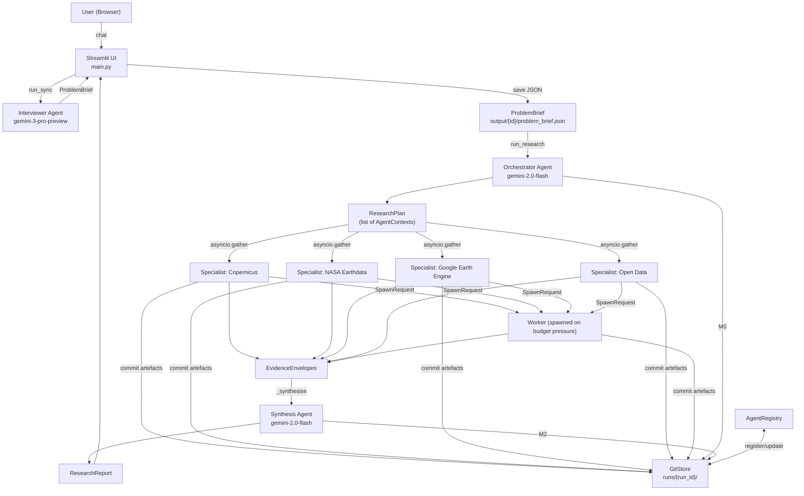
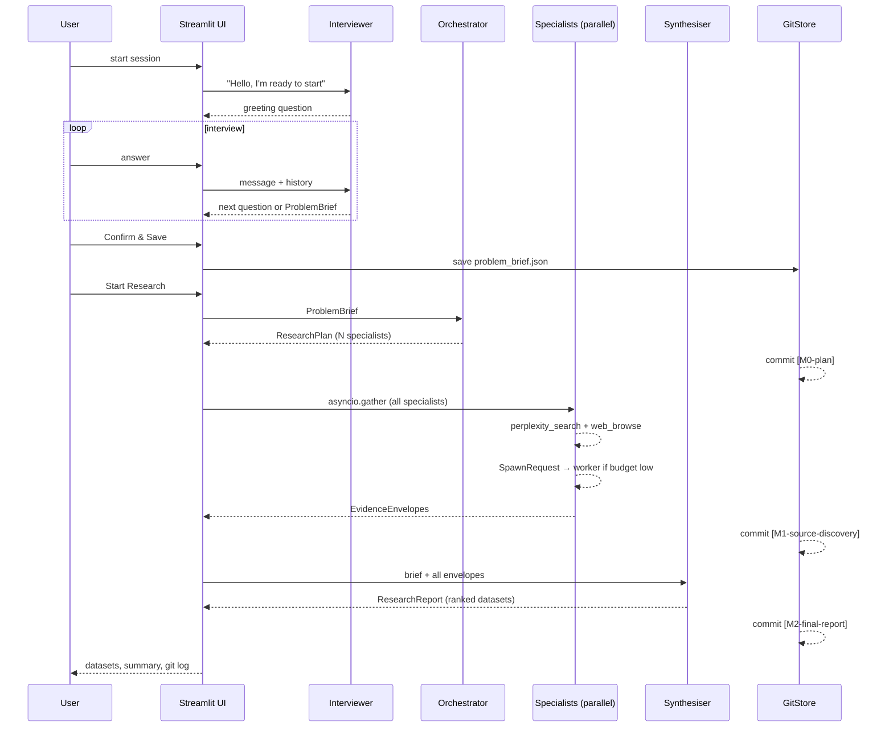
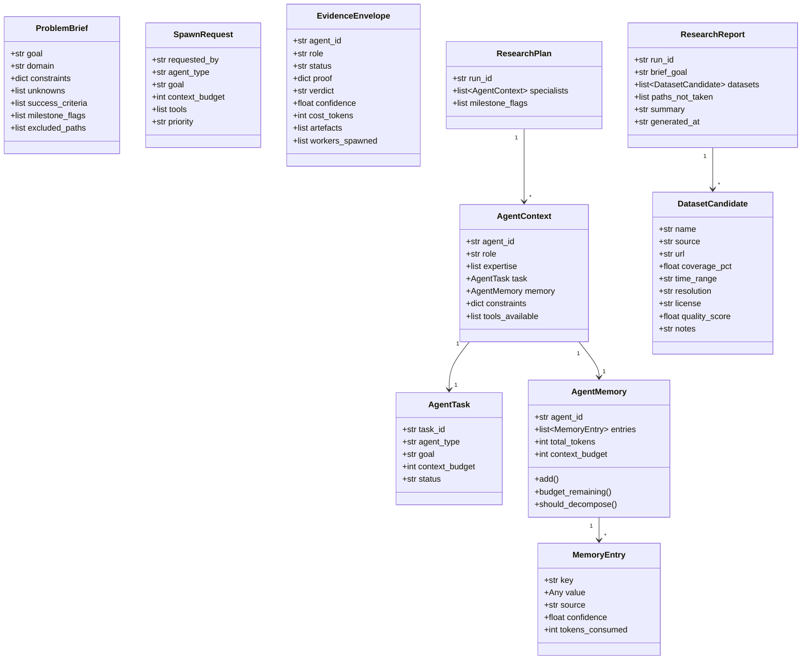
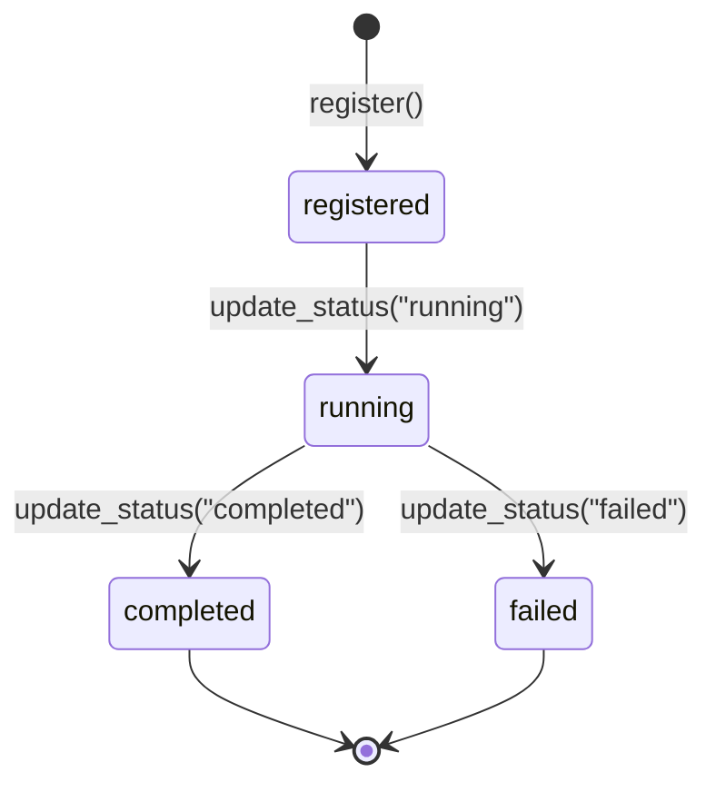
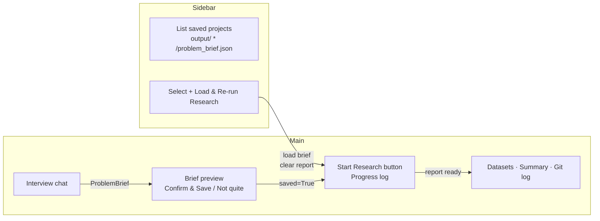

# Slow AI

A deliberate, inspectable multi-agent workflow system. The user is interviewed to produce
a structured problem brief, which is handed to a planner and a fleet of specialist agents
that execute in parallel, committing all artefacts to a git-backed audit trail before
synthesising a final report. The process templates change per domain. The principles do not.

---

## Table of Contents

- [Philosophy](#philosophy)
- [Architecture Overview](#architecture-overview)
- [Pipeline Stages](#pipeline-stages)
- [Agents](#agents)
- [Data Models](#data-models)
- [Tools](#tools)
- [Execution Layer](#execution-layer)
- [UI](#ui)
- [Configuration](#configuration)
- [Running the App](#running-the-app)
- [Tests](#tests)
- [Status](#status)
- [Open Work](#open-work)

---

## Philosophy

Slow AI is a deliberate, inspectable multi-agent workflow system. The name is not about
pace — it is about provenance. Every decision an agent makes, every path it takes or
skips, every piece of evidence it collects is recorded, versioned, and inspectable. You
can always answer the question: *how did we get here?*

---

### The core idea

Most agentic systems optimise for getting to an answer fast. Slow AI optimises for
understanding what happened and why. Speed matters. But in any domain where the quality
of your outputs determines the quality of everything built on top of them — reliability,
traceability, and trust matter more.

The guiding principle is borrowed from distributed systems: **Slow AI shows its work.**

Slow AI is domain-agnostic. The same system that runs a data research workflow runs a
code review workflow, a due diligence workflow, a competitive analysis workflow, or any
other multi-step process that benefits from specialist agents, structured evidence, and a
permanent audit trail. The process templates change. The principles do not.

---

### Why distributed systems, not AI frameworks

Agents are distributed systems on steroids. The failure modes are identical — runaway
processes, silent failures, duplicate side effects, uncontrolled costs, cascading errors.
The solutions are also identical, and they have existed for thirty to forty years.

Slow AI is built on five principles from distributed systems:

**Blast radius** — every agent operates with minimum permissions. Read-only by default.
Write access is explicit and justified. The worst-case action of every tool is evaluated
before the tool is granted.

**Circuit breakers** — a watchdog observer knows about every agent. When a threshold is
breached — time, tokens, cost, destructive action — the circuit opens. The agent stops.
The state is preserved. A human is informed.

**Byzantine fault tolerance** — agents do not return verdicts. They return evidence
envelopes. An envelope contains proof of the work done: sources checked, items found,
coverage, confidence score. If the proof is absent or insufficient, the verdict is
meaningless regardless of the status code.

**Idempotency** — every agent action is safe to run twice. Execution state lives outside
the agents, in a git repository. If a run fails at any point, it resumes from the last
committed milestone. Completed work is never repeated.

**MAPE-K** — Monitor, Analyse, Plan, Execute, with a shared Knowledge base. The
orchestrator plans. Specialists execute. An observer watches everything. The git
repository is the knowledge base — the permanent, versioned record of what every agent
in every run knew and did.

---

### Human in the loop

Human involvement is a first-class design primitive in Slow AI — not an exception handler.

The orchestrator can decide at any milestone that the run should not continue until a
human has reviewed and approved. This is not a failure state. It is a deliberate
checkpoint — the system recognising that a decision requires human judgement before
agents proceed.

Three things make this work cleanly:

**Git as the inspection surface.** Every artefact produced by every agent up to that
point is committed to the run's git repository. A human can open the repository, read
every evidence envelope, inspect every memory store, trace every decision, and understand
exactly what the agents did and why — before deciding whether to continue, redirect, or
stop.

**Structured pause, not a crash.** When the orchestrator requests human review, the run
state is fully preserved. The agent registry, all milestone commits, all memory stores —
everything is intact. When the human approves, the run resumes from exactly where it
paused. Nothing is lost, nothing is re-run unnecessarily.

**Granular intervention.** A human interacting with a paused run is not limited to
approve or reject. Because every artefact is a versioned file in git, a human can edit
an artefact directly — correcting a dataset candidate, updating a search query, removing
a bad result — and the run resumes with the corrected state. The human edit is itself a
commit. The intervention is part of the audit trail.

This model also supports asynchronous human review. The orchestrator does not block a
thread waiting for a human. It pauses the run, emits a notification, and picks up when
the human responds — whether that is five minutes or five days later. Long-running
workflows that span multiple human review cycles are a natural use case, not an edge case.

---

### The agent model

Slow AI uses a heterogeneous agent model. Agents are not differentiated only by skill —
they are differentiated by memory.

Three things are independent:

- **Agent type** — what the agent knows how to do (role, tools, expertise)
- **Agent memory** — what this specific instance has accumulated in this run
- **Agent task** — the goal right now, which may be a decomposition of a larger goal

The same agent type can be instantiated many times in a single run, each carrying
different accumulated memory. Two instances of the same specialist type, working on
different sub-problems, build separate knowledge and return separate evidence. Same type.
Different instance. Different knowledge. Both exist simultaneously. Both contribute to
the same run.

Context size is a first-class constraint. When a task is too large for a single agent's
context budget, it is decomposed into sub-tasks. Each child agent gets a bounded context
budget, does its work, writes its memory, and the parent synthesises. The decomposition
tree is stored explicitly in git. Every split is observable and auditable.

---

### The control plane

The orchestrator is the control plane. It does not micromanage what agents do — but it
always knows what exists, who spawned whom, and what state everything is in.

Agents can spawn workers dynamically mid-execution. When a specialist agent completes
part of its work and determines that sub-tasks should run in parallel, it sends a
`SpawnRequest` to the orchestrator. The orchestrator registers the worker with the correct
lineage before it runs. The control plane is always ahead of the workload.

This is the Kubernetes pattern applied to agent systems. Every spawn is a registration
event. The `AgentRegistry` is the API server. No agent runs without being known. The full
agent tree — with lineage, status, token usage, and memory paths — is committed to git at
every milestone and visualised as a live DAG in the interface.

---

### Process templates

A process is a reusable skeleton of milestone-ordered steps, where each step is bound to
skills at runtime based on the domain and the problem brief.

The steps of a research process are consistent regardless of what is being researched.
The skills that fill each step — which APIs to call, which tools to use, which validation
logic to apply — are domain-specific. A process template separates these two concerns.

This means the same orchestration logic that runs a data research workflow can run a
regulatory review workflow, a literature survey, a supplier evaluation, or any other
structured investigation. New domains are added by registering new skills, not by
rewriting the process.

Every run of a process is a data point. Which skill bindings produced better evidence?
Which step ordering reduced cost? Which agent configurations were most reliable? Over
time, the system learns which processes work and improves them.

---

### Git as the execution record

Every run is a git repository. Every milestone is a commit. Every artefact — evidence
envelopes, memory stores, agent outputs, registry snapshots, human edits — is a versioned
file.

The git repository is simultaneously:

- The audit trail — what happened, in order, with full diffs
- The recovery point — resume from the last commit if a run fails
- The human review surface — inspect any artefact at any point before deciding to continue
- The learning dataset — compare runs, compare paths, compare agent decisions over time

Paths not taken are also committed. If a branch was considered and skipped — API timeout,
missing skill, cost ceiling, stop verdict, human rejection — that decision is recorded.
A run's git history is not just a record of what succeeded. It is a record of everything
that was attempted and why each outcome happened.

---

### The interview

Workflow quality is bounded by problem definition quality. Most agentic systems start
with a text box. Slow AI starts with a conversation.

The interview agent is a consultant, not a form. It asks one question at a time. It
pushes back on vagueness. It surfaces assumptions the user did not know they were making.
It does not proceed until the user confirms a precise, structured problem brief.

The confirmed brief is the first commit in the run's git repository. It is the contract
that the entire workflow runs against. Every agent's task, every milestone flag, every
evidence requirement traces back to it.

---

### What Phase 3 will add

The current system runs workflows against a fixed set of tool capabilities. Phase 3
introduces:

**Temporal** — durable execution. If the process crashes at any depth of the agent tree,
Temporal resumes from the last committed registry state. Workers that completed are not
re-run.

**Observer operator** — a separate process that watches the `AgentRegistry` in real time.
Detects runaway spawning, loops, cost ceiling breaches, confidence scores dropping across
a subtree. Signals the orchestrator to prune, pause, or escalate — including triggering
human-in-the-loop checkpoints automatically when anomalies are detected.

**Skills repository** — skills are registered artefacts with descriptions, typed I/O
schemas, performance history, and blast radius classifications. New skills can be added
without redeploying the system. GitHub repositories that follow the skill contract can be
pulled, validated, and registered at runtime. Agents that repeatedly fail on a task type
signal that a new skill is needed.

**Agent repository** — agent types are registered with their prompts, expertise lists,
and track records. The system learns which agent configurations produce better evidence
envelopes over time. Same agent type, better context — the knowledge compounds.

---

### The name

Slow AI is not slow. It is deliberate.

The speed that AI gives us is only as valuable as the reliability underneath it. Just
because we can move fast does not mean we should forget everything we learned about
building machines that last.

This is the time to forge it all together — the new and the proven — and do what we
humans do best.

*Create.*

*Trust no node. Trust is built. Trust is designed.*

---

## Architecture Overview



---

## Pipeline Stages



---

## Agents

### Interviewer
| Property | Value |
|---|---|
| Model | `gemini-3-pro-preview` |
| Output | `str \| ProblemBrief` |
| File | `src/slow_ai/agents/interviewer.py` |

Conducts a structured conversation, asking one question at a time, pushing back on vague
answers, surfacing assumptions, and presenting a complete brief for user confirmation before
returning a `ProblemBrief`.

---

### Orchestrator
| Property | Value |
|---|---|
| Model | `gemini-2.0-flash` |
| Output | `ResearchPlan` |
| File | `src/slow_ai/agents/orchestrator.py` |

Reads the `ProblemBrief` and decides which specialist roles are needed and what their
individual tasks are. For earth observation briefs it typically assigns:

| Specialist role | Covers |
|---|---|
| `copernicus_specialist` | Sentinel-2, Sentinel-1 SAR, ESA Open Access Hub |
| `nasa_earthdata_specialist` | MODIS, Landsat, SRTM, NASA CMR API |
| `google_earth_engine_specialist` | GEE catalogue, STAC APIs |
| `open_data_specialist` | national agencies, data.gov, OpenAfrica |

Context budgets are set per specialist (3 000–6 000 tokens) based on task complexity.

---

### Specialist
| Property | Value |
|---|---|
| Model | `gemini-3-pro-preview` |
| Output | `EvidenceEnvelope` |
| File | `src/slow_ai/agents/specialist.py` |

Each specialist is built dynamically from an `AgentContext`. It has two tools:

- `search(query)` — calls Perplexity; returns answer + citation URLs
- `browse(url)` — fetches and strips a web page; returns clean text

Workflow per specialist:
1. Formulate search query from task goal + brief constraints.
2. Call `search()`, collect citation URLs.
3. Call `browse()` on top URLs, extract dataset details.
4. Store findings as `MemoryEntry` objects with confidence scores.
5. If token budget is running low, emit a `SpawnRequest` to create a focused worker.
6. Return an `EvidenceEnvelope` with all datasets found, overall confidence, and a verdict
   (`continue` / `stop` / `escalate`).

All specialists run concurrently via `asyncio.gather()`.

---

### Synthesiser (inline agent in runner)
| Property | Value |
|---|---|
| Model | `gemini-2.0-flash` |
| Output | `ResearchReport` |
| File | `src/slow_ai/research/runner.py` |

Receives all `EvidenceEnvelope` objects, deduplicates datasets, scores each on coverage,
resolution, licence, and completeness, ranks them, and writes a summary.

---

## Data Models



---

## Tools

### `perplexity_search(query) → PerplexityResult`
`src/slow_ai/tools/perplexity.py`

Calls the Perplexity `sonar` model. Returns a synthesised answer and a list of citation
URLs. If the API returns no citations, URLs are extracted from the answer text as a
fallback.

### `web_browse(url, max_chars=4000) → BrowseResult`
`src/slow_ai/tools/web_browse.py`

Fetches the URL with `httpx`, strips navigation, scripts, and boilerplate with
`BeautifulSoup`, and returns up to 4 000 characters of body text.

---

## Execution Layer

### GitStore
`src/slow_ai/execution/git_store.py`

Initialises a bare git repository at `runs/{run_id}/` and commits research artefacts at
each milestone. This gives a full, reproducible audit trail for every run.

| Commit tag | What is committed |
|---|---|
| `[init]` | `problem_brief.json` |
| `[M0-plan]` | `research_plan.json`, `registry.json` |
| `[M1-source-discovery]` | `envelopes/*.json`, `memory/*.json`, `registry.json` |
| `[M2-final-report]` | `report.json`, `registry.json` |

Skipped paths (failed agents, stop verdicts) are recorded as `skipped_paths/*.json`.

### AgentRegistry
`src/slow_ai/execution/registry.py`

In-memory control plane committed to git as `registry.json` at each milestone.
Tracks every agent across its full lifecycle.



Each registration records:
- `agent_id`, `agent_type`, `parent_agent_id`
- `task_id`, `status`, `spawned_at`, `completed_at`
- `tokens_used`, `memory_path`, `children[]`

`get_dag()` returns nodes + edges for future DAG visualisation.

---

## UI

`main.py` — single-page Streamlit app.



Session state keys: `messages`, `history`, `brief`, `saved`, `report`, `research_log`.

---

## Configuration

Copy `.env.example` to `.env` and fill in:

```
GEMINI_API_KEY=...
PERPLEXITY_KEY=...
```

Settings are loaded via `pydantic-settings` from `src/slow_ai/config.py`.

---

## Running the App

```bash
# install
pip install -e .

# run
streamlit run main.py
```

---

## Tests

| File | Type | What it covers |
|---|---|---|
| `tests/test_registry.py` | Unit | `AgentRegistry` — register, hierarchy, status transitions, memory paths, snapshot, DAG |
| `tests/test_runner.py` | Integration | Full `run_research()` pipeline end-to-end (requires API keys) |
| `tests/test_specialists.py` | Manual/exploratory | Orchestrator planning output; single-specialist execution |

Run unit tests only:
```bash
pytest tests/test_registry.py -v
```

Run full integration test (costs API quota):
```bash
pytest tests/test_runner.py -v -s
```

---

## Status

| Component | State |
|---|---|
| Interviewer agent | Working |
| ProblemBrief save / load | Working |
| Orchestrator planning | Working |
| Specialist parallel execution | Working |
| Perplexity search tool | Working |
| Web browse tool | Working |
| Worker spawning (SpawnRequest) | Implemented — under test |
| GitStore milestone commits | Working |
| AgentRegistry + DAG | Working |
| Synthesis agent | Working |
| Streamlit UI — interview flow | Working |
| Streamlit UI — sidebar project reload | Working |
| Registry unit tests | Passing |
| Specialist integration tests | In progress — failures being debugged |
| Runner integration test | In progress — failures being debugged |

---

## Open Work

- [ ] **Specialist stability** — specialists sometimes fail mid-run; error handling and retry logic needed
- [ ] **Worker spawn integration test** — `SpawnRequest` path not yet covered by automated tests
- [ ] **DAG visualisation** — `get_dag()` exists on `AgentRegistry`; no UI widget yet
- [ ] **Report persistence** — `ResearchReport` is stored in session state only; should be saved to `output/{id}/report.json` so it survives page reload
- [ ] **Brief versioning** — re-running research on an existing brief creates a new `run_id` but both share the same `output/{id}/`; runs should be linked to their brief explicitly
- [ ] **Token cost tracking** — `cost_tokens` is recorded per envelope but not surfaced in the UI
- [ ] **Synthesis quality** — quality scoring is done by the LLM; a deterministic scoring pass would improve reproducibility
- [ ] **Auth / multi-user** — no authentication; single-user local tool only
