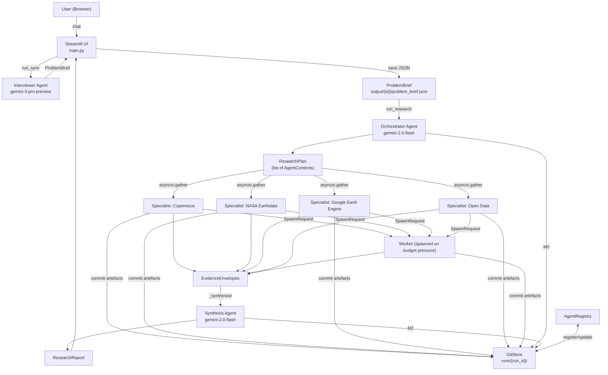
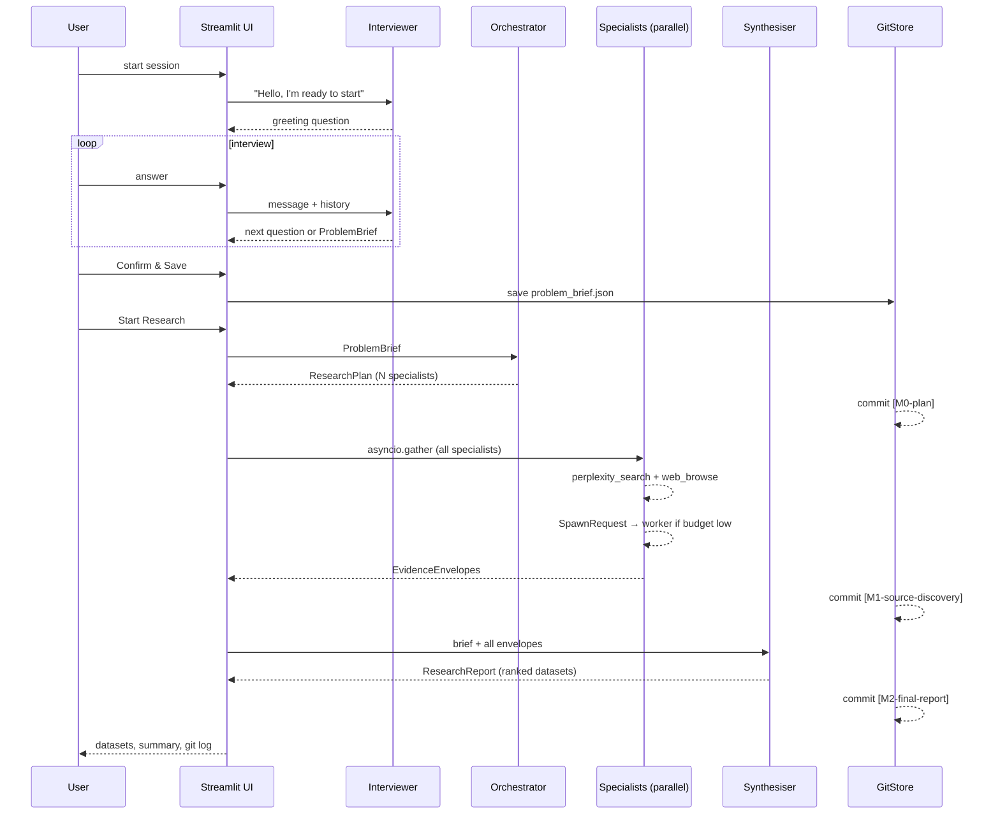
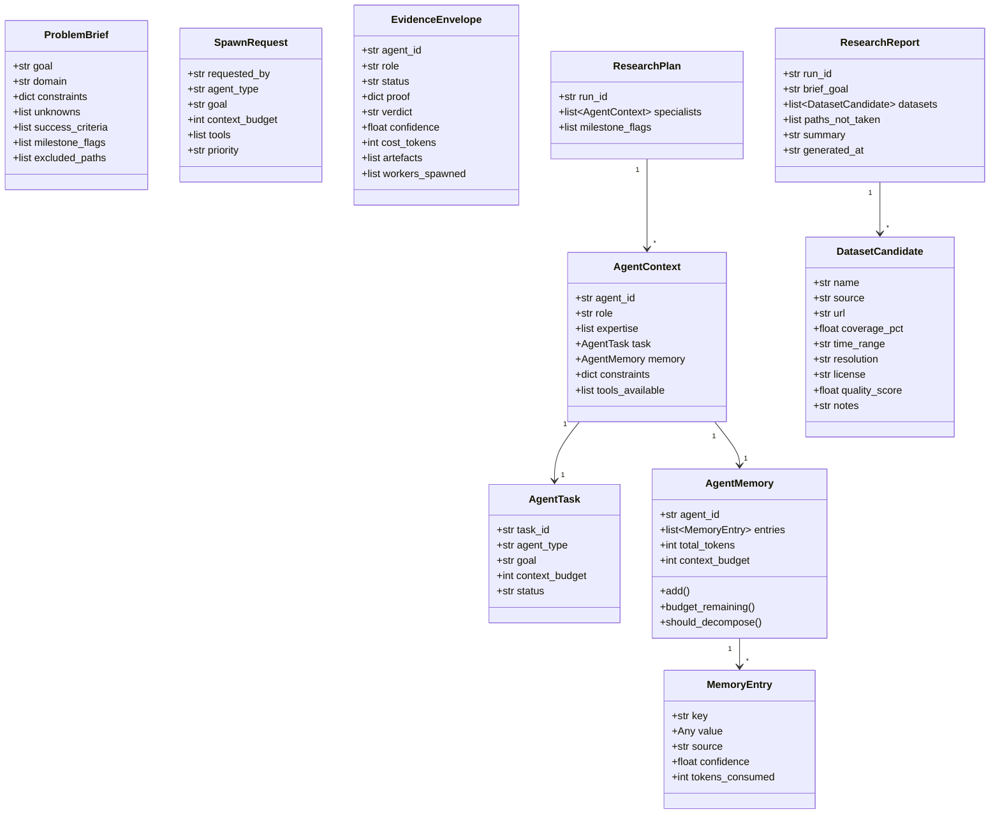
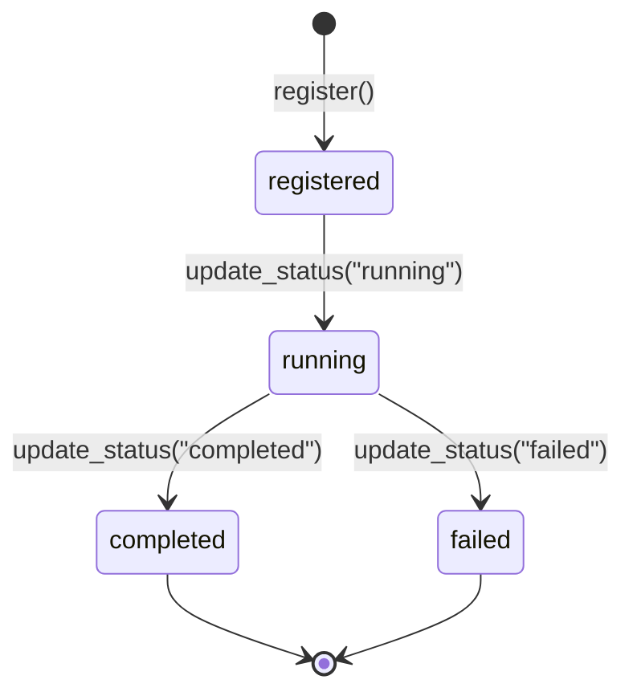
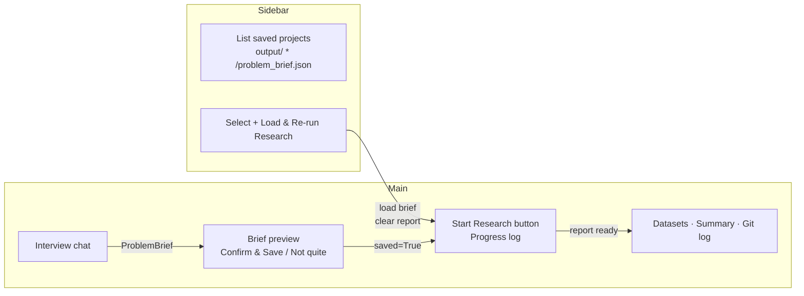

# Slow AI

A multi-agent research orchestration system for discovering earth observation datasets.
The user is interviewed to produce a structured problem brief, which is then handed to a
planner and a fleet of specialist agents that research data sources in parallel, committing
all artefacts to a git-backed audit trail before synthesising a final ranked report.

---

## Table of Contents

- [Architecture Overview](#architecture-overview)
- [Pipeline Stages](#pipeline-stages)
- [Agents](#agents)
- [Data Models](#data-models)
- [Tools](#tools)
- [Execution Layer](#execution-layer)
- [UI](#ui)
- [Configuration](#configuration)
- [Running the App](#running-the-app)
- [Tests](#tests)
- [Status](#status)
- [Open Work](#open-work)

---

## Architecture Overview



---

## Pipeline Stages



---

## Agents

### Interviewer
| Property | Value |
|---|---|
| Model | `gemini-3-pro-preview` |
| Output | `str \| ProblemBrief` |
| File | `src/slow_ai/agents/interviewer.py` |

Conducts a structured conversation, asking one question at a time, pushing back on vague
answers, surfacing assumptions, and presenting a complete brief for user confirmation before
returning a `ProblemBrief`.

---

### Orchestrator
| Property | Value |
|---|---|
| Model | `gemini-2.0-flash` |
| Output | `ResearchPlan` |
| File | `src/slow_ai/agents/orchestrator.py` |

Reads the `ProblemBrief` and decides which specialist roles are needed and what their
individual tasks are. For earth observation briefs it typically assigns:

| Specialist role | Covers |
|---|---|
| `copernicus_specialist` | Sentinel-2, Sentinel-1 SAR, ESA Open Access Hub |
| `nasa_earthdata_specialist` | MODIS, Landsat, SRTM, NASA CMR API |
| `google_earth_engine_specialist` | GEE catalogue, STAC APIs |
| `open_data_specialist` | national agencies, data.gov, OpenAfrica |

Context budgets are set per specialist (3 000–6 000 tokens) based on task complexity.

---

### Specialist
| Property | Value |
|---|---|
| Model | `gemini-3-pro-preview` |
| Output | `EvidenceEnvelope` |
| File | `src/slow_ai/agents/specialist.py` |

Each specialist is built dynamically from an `AgentContext`. It has two tools:

- `search(query)` — calls Perplexity; returns answer + citation URLs
- `browse(url)` — fetches and strips a web page; returns clean text

Workflow per specialist:
1. Formulate search query from task goal + brief constraints.
2. Call `search()`, collect citation URLs.
3. Call `browse()` on top URLs, extract dataset details.
4. Store findings as `MemoryEntry` objects with confidence scores.
5. If token budget is running low, emit a `SpawnRequest` to create a focused worker.
6. Return an `EvidenceEnvelope` with all datasets found, overall confidence, and a verdict
   (`continue` / `stop` / `escalate`).

All specialists run concurrently via `asyncio.gather()`.

---

### Synthesiser (inline agent in runner)
| Property | Value |
|---|---|
| Model | `gemini-2.0-flash` |
| Output | `ResearchReport` |
| File | `src/slow_ai/research/runner.py` |

Receives all `EvidenceEnvelope` objects, deduplicates datasets, scores each on coverage,
resolution, licence, and completeness, ranks them, and writes a summary.

---

## Data Models



---

## Tools

### `perplexity_search(query) → PerplexityResult`
`src/slow_ai/tools/perplexity.py`

Calls the Perplexity `sonar` model. Returns a synthesised answer and a list of citation
URLs. If the API returns no citations, URLs are extracted from the answer text as a
fallback.

### `web_browse(url, max_chars=4000) → BrowseResult`
`src/slow_ai/tools/web_browse.py`

Fetches the URL with `httpx`, strips navigation, scripts, and boilerplate with
`BeautifulSoup`, and returns up to 4 000 characters of body text.

---

## Execution Layer

### GitStore
`src/slow_ai/execution/git_store.py`

Initialises a bare git repository at `runs/{run_id}/` and commits research artefacts at
each milestone. This gives a full, reproducible audit trail for every run.

| Commit tag | What is committed |
|---|---|
| `[init]` | `problem_brief.json` |
| `[M0-plan]` | `research_plan.json`, `registry.json` |
| `[M1-source-discovery]` | `envelopes/*.json`, `memory/*.json`, `registry.json` |
| `[M2-final-report]` | `report.json`, `registry.json` |

Skipped paths (failed agents, stop verdicts) are recorded as `skipped_paths/*.json`.

### AgentRegistry
`src/slow_ai/execution/registry.py`

In-memory control plane committed to git as `registry.json` at each milestone.
Tracks every agent across its full lifecycle.



Each registration records:
- `agent_id`, `agent_type`, `parent_agent_id`
- `task_id`, `status`, `spawned_at`, `completed_at`
- `tokens_used`, `memory_path`, `children[]`

`get_dag()` returns nodes + edges for future DAG visualisation.

---

## UI

`main.py` — single-page Streamlit app.



Session state keys: `messages`, `history`, `brief`, `saved`, `report`, `research_log`.

---

## Configuration

Copy `.env.example` to `.env` and fill in:

```
GEMINI_API_KEY=...
PERPLEXITY_KEY=...
```

Settings are loaded via `pydantic-settings` from `src/slow_ai/config.py`.

---

## Running the App

```bash
# install
pip install -e .

# run
streamlit run main.py
```

---

## Tests

| File | Type | What it covers |
|---|---|---|
| `tests/test_registry.py` | Unit | `AgentRegistry` — register, hierarchy, status transitions, memory paths, snapshot, DAG |
| `tests/test_runner.py` | Integration | Full `run_research()` pipeline end-to-end (requires API keys) |
| `tests/test_specialists.py` | Manual/exploratory | Orchestrator planning output; single-specialist execution |

Run unit tests only:
```bash
pytest tests/test_registry.py -v
```

Run full integration test (costs API quota):
```bash
pytest tests/test_runner.py -v -s
```

---

## Status

| Component | State |
|---|---|
| Interviewer agent | Working |
| ProblemBrief save / load | Working |
| Orchestrator planning | Working |
| Specialist parallel execution | Working |
| Perplexity search tool | Working |
| Web browse tool | Working |
| Worker spawning (SpawnRequest) | Implemented — under test |
| GitStore milestone commits | Working |
| AgentRegistry + DAG | Working |
| Synthesis agent | Working |
| Streamlit UI — interview flow | Working |
| Streamlit UI — sidebar project reload | Working |
| Registry unit tests | Passing |
| Specialist integration tests | In progress — failures being debugged |
| Runner integration test | In progress — failures being debugged |

---

## Open Work

- [ ] **Specialist stability** — specialists sometimes fail mid-run; error handling and retry logic needed
- [ ] **Worker spawn integration test** — `SpawnRequest` path not yet covered by automated tests
- [ ] **DAG visualisation** — `get_dag()` exists on `AgentRegistry`; no UI widget yet
- [ ] **Report persistence** — `ResearchReport` is stored in session state only; should be saved to `output/{id}/report.json` so it survives page reload
- [ ] **Brief versioning** — re-running research on an existing brief creates a new `run_id` but both share the same `output/{id}/`; runs should be linked to their brief explicitly
- [ ] **Token cost tracking** — `cost_tokens` is recorded per envelope but not surfaced in the UI
- [ ] **Synthesis quality** — quality scoring is done by the LLM; a deterministic scoring pass would improve reproducibility
- [ ] **Auth / multi-user** — no authentication; single-user local tool only
