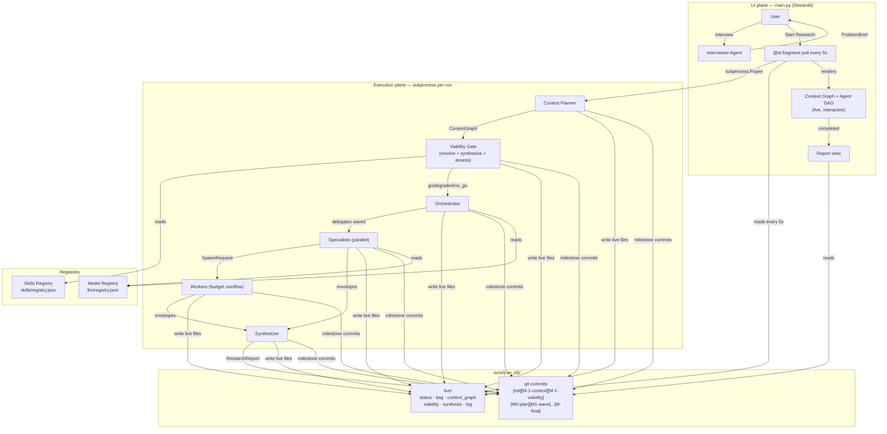

```
 ██████  ██       ██████  ██     ██      █████  ██
██        ██      ██    ██ ██     ██    ██   ██  ██
 █████    ██      ██    ██ ██  █  ██    ███████  ██
     ██   ██      ██    ██ ██ ███ ██    ██   ██  ██
 ██████   ███████  ██████   ███ ███     ██   ██  ██
```

> **Agentic work orchestration. Built like a distributed system.**


---

## Table of Contents

- [Philosophy](#philosophy)
- [Architecture Overview](#architecture-overview)
- [Pipeline Stages](#pipeline-stages)
- [Skills Registry](#skills-registry)
- [Model Registry — Bring Your Own Model](#model-registry--bring-your-own-model)
- [Viability Gate](#viability-gate)
- [Agents](#agents)
- [Tools](#tools)
- [Data Models](#data-models)
- [Execution Layer](#execution-layer)
- [UI](#ui)
- [Configuration](#configuration)
- [Running the App](#running-the-app)
- [Status](#status)
- [Roadmap](#roadmap)

---

## Philosophy

Slow AI is a deliberate, inspectable multi-agent workflow system. The name is not
about pace — it is about provenance. Every decision an agent makes, every path it
takes or skips, every piece of evidence it collects is recorded, versioned, and
inspectable. You can always answer the question: *how did we get here?*

Most agentic systems optimise for getting to an answer fast. Slow AI optimises for
understanding what happened and why. Speed matters. But in any domain where the
quality of your outputs determines the quality of everything built on top of them —
reliability, traceability, and trust matter more.

The guiding principle is borrowed from distributed systems: **Slow AI shows its work.**

Slow AI is domain-agnostic. Research was the first domain built on it — but the same
orchestration layer runs software delivery pipelines, content production workflows,
sales intelligence, incident response, compliance monitoring, or any structured work
that benefits from specialist agents, a skills registry that compounds over time, and
a permanent audit trail. If the work can be expressed as a directed graph of tasks
with declared skill requirements, Slow AI can run it.

---

### Why distributed systems, not AI frameworks

Agents are distributed systems. The failure modes are identical — runaway processes,
silent failures, duplicate side effects, uncontrolled costs, cascading errors. The
solutions are also identical, and they have existed for thirty to forty years.

Slow AI is built on five principles from distributed systems:

**Blast radius** — every agent operates with minimum permissions. Tools are granted
explicitly based on the skills required by the work item.

**Circuit breakers** — a watchdog observer knows about every agent. When a threshold
is breached — time, tokens, cost — the circuit opens. The agent stops. The state is
preserved.

**Byzantine fault tolerance** — agents do not return verdicts. They return evidence
envelopes. An envelope contains proof of the work done: sources checked, findings,
confidence score. The verdict is only as good as the proof behind it.

**Idempotency** — every agent action is safe to run twice. Execution state lives
outside the agents, in a git repository. If a run fails at any point, it resumes
from the last committed milestone.

**MAPE-K** — Monitor, Analyse, Plan, Execute, with a shared Knowledge base. The
orchestrator plans. Specialists execute. The git repository is the knowledge base —
the permanent, versioned record of what every agent in every run knew and did.

---

### The context graph

Before any agent is created, the system produces a **context graph** — a directed
graph of work items representing a complete decomposition of the goal.

Each node is a piece of work with a name, description, success criteria, declared
dependencies, and — critically — **the skills required to execute it**. Each edge
is a dependency. The graph is the blueprint: it captures what *needs to happen*
independently of how it will be executed.

Only after the context graph is finalised does the orchestrator assign agents to
nodes. This two-step orchestration gives properties a flat plan cannot:

- **Completeness visibility** — every work item must be addressed. Gaps surface
  explicitly rather than silently.
- **Skill-aware planning** — the context planner declares what skills each work
  item needs, including skills that do not yet exist. Gaps are caught before a
  single agent fires.
- **Replayability** — a context graph can be re-executed with different agents,
  different models, or different tools without changing the problem definition.
- **Retrospective clarity** — the UI shows two graphs: the context graph (what
  needed to happen) and the agent DAG (what actually ran). The overlay shows
  which agents covered which work items.

---

### The accumulation flywheel

Every run makes the system more capable. When skill gaps are detected before
execution, a synthesizer agent attempts to resolve them by mapping missing skills
to existing tools. Synthesized skills are written back to the registry immediately
and persist across runs. The 50th run of a workflow is fundamentally more capable
than the first — not because a model was retrained, but because the system learned
what it needs and built the skills to do it.

---

### Human in the loop

Human involvement is a first-class design primitive — not an exception handler.

The orchestrator can decide at any milestone that the run should pause for human
review. The full run state is preserved. Every artefact produced up to that point
is committed and inspectable. When the human approves, the run resumes exactly
where it paused.

Three things make this work:

- **Git as the inspection surface** — every artefact, every evidence envelope,
  every agent memory is a versioned file. A human can read the full record before
  deciding whether to continue, redirect, or stop.
- **Structured pause, not a crash** — nothing is lost, nothing is re-run.
- **Granular intervention** — a human can edit artefacts directly in git. The
  human edit is itself a commit and part of the audit trail.

---

### The name

Slow AI is not slow. It is deliberate.

The speed that AI gives us is only as valuable as the reliability underneath it.
Just because we can move fast does not mean we should forget everything we learned
about building machines that last.

*Trust no node. Trust is built. Trust is designed.*

---

## Architecture Overview

Two independent planes sharing nothing except files on disk:



**Key contract:** the execution plane writes plain JSON to `runs/{run_id}/live/`.
Streamlit polls those files via `@st.fragment(run_every="5s")`. No shared state,
no threading, no asyncio coupling. Any future UI (React, CLI) can replace Streamlit
without touching the execution plane.

---

## Pipeline Stages

The pipeline is domain-agnostic. The brief describes the work; the context planner
decomposes it into a skill-annotated graph; specialists execute using whatever tools
the registry provides. The current implementation uses research terminology in its
data model names — the same engine runs any structured agentic work.

```
Interview → ProblemBrief confirmed
  │
  ▼
run_context_planner(brief)                    ← reasoning model
  │  Produces ContextGraph
  │  Each WorkItem declares required_skills
  │  Committed as [M-1-context]
  ▼
Viability Gate
  │  1. resolve_skills() — structural BFS, finds gaps
  │  2. synthesize_skills() — LLM maps gaps to existing tools
  │     Writes new skills to registry.json immediately
  │  3. resolve_skills() — re-run with expanded registry
  │  4. viability_assess() — semantic go/degraded/no_go decision
  │  Committed as [M-1-viability]
  │
  ├── no_go (coverage = 0%) → write capability_checkpoint.json
  │                            status = blocked_on_capabilities
  │                            STOP
  │
  └── go / degraded → build working_graph (executable items only)
  │
  ▼
run_orchestrator(brief, working_graph, ready_items)   ← reasoning model
  │  Produces ResearchPlan (wave 1 specialists)
  │  Each specialist gets tools resolved from required_skills
  │  Committed as [M0-plan]
  ▼
┌──────────────────────────────────────────────────────┐
│  WAVE LOOP (max 5 waves, circuit breaker)            │
│                                                      │
│  Run specialists in parallel                         │
│    web_search → perplexity_search tool               │
│    web_browse → web_browse tool                      │
│    code_execution → generate_code() + execute()      │
│  Commit [M{N}-wave] — envelopes + artefacts + .py    │
│                                                      │
│  orchestrator_assess(brief, graph, envelopes, ready) │
│  Commit [M{N}-assessment]                            │
│                                                      │
│  synthesize → exit                                   │
│  spawn_specialists → next wave                       │
│  escalate_to_human → checkpoint + pause              │
└──────────────────────────────────────────────────────┘
  │
  ▼
Synthesizer → ResearchReport
Committed as [M-final-report]
status = completed
```

---

## Skills Registry

`src/slow_ai/skills/registry.json`

Skills are abstract abilities. Tools are concrete implementations. Work items declare
the skills they require. The registry maps skills to the tools that implement them.

```json
{
  "skills": [
    {
      "name": "web_search",
      "description": "Search the web using natural language queries.",
      "tools": ["perplexity_search"],
      "source": "built-in"
    },
    {
      "name": "code_execution",
      "description": "Execute arbitrary Python in an isolated subprocess.",
      "tools": ["code_execution"],
      "source": "built-in"
    },
    {
      "name": "statistical_analysis",
      "description": "Statistical tests and modelling using scipy/pandas.",
      "tools": ["code_execution"],
      "source": "synthesized"
    }
  ]
}
```

**Skill resolution at dispatch time:** `work_item.required_skills` → registry →
`tools_for_skills()` → `AgentContext.tools_available`. Agents only receive the
tools their work item actually needs.

**Skill synthesis:** when a skill gap is detected, the synthesizer agent attempts
to map the missing skill to existing tools. Synthesized entries are written back
to `registry.json` immediately and persist across runs. Over time the registry
accumulates institutional knowledge about what the system knows how to do.

**Adding external skills:** add a JSON entry to `registry.json` with the skill
name, description, and the tools that implement it. No code changes required.
Future support for pulling skill definitions from open source repositories
(openclaw, nemoclaw, opencode) without redeploying.

---

## Model Registry — Bring Your Own Model

`src/slow_ai/llm/registry.json`

Every agent resolves its model from the registry by task type. No model IDs are
hardcoded in agent code.

```json
{
  "models": [
    {
      "name": "reasoning",
      "model_id": "google-gla:gemini-3.1-pro-preview",
      "provider": "google",
      "use_for": ["context_planning", "orchestration", "assessment", "viability_assess"]
    },
    {
      "name": "fast",
      "model_id": "google-gla:gemini-3-flash-preview",
      "provider": "google",
      "use_for": ["skill_synthesis", "report_synthesis", "interview"]
    },
    {
      "name": "code",
      "model_id": "google-gla:gemini-3.1-pro-preview",
      "provider": "google",
      "use_for": ["code_generation"]
    }
  ]
}
```

**Supported provider types:**

| Provider | Format | Notes |
|---|---|---|
| `google` | `google-gla:model-id` | Native pydantic_ai Google provider |
| `openai` | `openai:model-id` | Native pydantic_ai OpenAI provider |
| `anthropic` | `anthropic:model-id` | Native pydantic_ai Anthropic provider |
| `openai_compatible` | any model name | Ollama, vLLM, LM Studio, any custom endpoint |

**Running a local model (e.g. Qwen via Ollama):**

```json
{
  "name": "qwen_code",
  "model_id": "qwen2.5-coder:7b",
  "provider": "openai_compatible",
  "base_url": "http://localhost:11434/v1",
  "api_key": "ollama",
  "use_for": ["code_generation"]
}
```

Add the entry, restart the app. No code changes. The code generation slot
immediately routes to Qwen running on your own infrastructure.

**Current task → model routing:**

| Task | Model tier | Why |
|---|---|---|
| `context_planning` | reasoning | Complex goal decomposition |
| `orchestration` | reasoning | Wave planning, dependency analysis |
| `assessment` | reasoning | Coverage evaluation, next-wave decisions |
| `viability_assess` | reasoning | Semantic gap judgment |
| `specialist_research` | reasoning | Multi-turn research with tool use |
| `code_generation` | code | Dedicated slot — swap to specialist without touching agents |
| `skill_synthesis` | fast | Straightforward skill-to-tool mapping |
| `report_synthesis` | fast | Structured summarisation |
| `interview` | fast | Conversational brief elicitation |

---

## Viability Gate

Before a single wave fires, the viability gate checks whether the planned work can
actually be executed with the skills currently in the registry.

```
resolve_skills(graph, registry)
  → gap items (direct missing skills)
  → all_blocked items (gap items + transitive dependents via BFS)
  → SkillGap objects (per missing skill, with downstream impact)

if gaps:
    synthesize_skills(gaps, registry)
      → synthesized skills written to registry.json immediately
      → needs_new_tool: GitHub search queries for unresolvable gaps
    resolve_skills(graph, registry)   ← re-run with expanded registry

viability_assess(brief, graph, executable_ids, blocked_ids, gaps)
  → "go"       — all skills available
  → "degraded" — some gaps remain, but sufficient work can proceed
                 blocked items committed to paths/not_taken/
                 working_graph filtered to executable items only
  → "no_go"    — coverage = 0%, nothing can execute, run aborted
```

**Hard rule:** if any items are executable (coverage > 0%), the system always runs
in at least `degraded` mode. Partial results are more useful than no results.
`no_go` only fires when literally nothing can execute.

The viability decision and synthesis results are committed to git as
`[M-1-viability]` — the gap record accumulates across runs and becomes a durable
capability backlog.

---

## Agents

### Interviewer
| Property | Value |
|---|---|
| Model | `fast` (from registry) |
| Output | `str \| ProblemBrief` |
| File | `src/slow_ai/agents/interviewer.py` |

Conducts a structured conversation — one question at a time, pushing back on
vagueness, surfacing assumptions — until a complete `ProblemBrief` is confirmed.
The brief is the first git commit and the contract the entire run executes against.

---

### Context Planner
| Property | Value |
|---|---|
| Model | `reasoning` (from registry) |
| Output | `ContextGraph` |
| File | `src/slow_ai/agents/orchestrator.py` |

Decomposes the brief into a directed graph of work items. Each item declares
`required_skills` — the abstract abilities needed to execute it. The planner is
given the current skill registry as context but is explicitly instructed to plan
for the ideal approach, declaring skills that don't exist yet. Gaps surface in the
viability gate rather than being silently omitted.

---

### Orchestrator
| Property | Value |
|---|---|
| Model | `reasoning` (from registry) |
| Output | `ResearchPlan` |
| File | `src/slow_ai/agents/orchestrator.py` |

Assigns specialist agents to the current wave's ready work items (those whose
upstream dependencies are satisfied). Dependency ordering is enforced in code via
`_ready_work_items(graph, covered)` — not left to the LLM.

---

### Specialist
| Property | Value |
|---|---|
| Model | `specialist_research` (from registry) |
| Output | `EvidenceEnvelope` |
| File | `src/slow_ai/agents/specialist.py` |

Built dynamically from an `AgentContext`. Receives only the tools that correspond
to its work item's required skills. Available tools:

| Tool | Registered when |
|---|---|
| `search(query)` | skill includes `perplexity_search` |
| `browse(url)` | skill includes `web_browse` |
| `generate_code(description)` | skill includes `code_execution` |
| `execute(code)` | skill includes `code_execution` |

For code execution work items, the specialist calls `generate_code()` first (which
uses the `code` model to produce well-structured Python and saves the `.py` file to
the artefacts directory), then `execute()` to run it. Generated code files are
committed to git alongside the outputs they produced.

Returns an `EvidenceEnvelope` with proof, verdict, confidence, and artefact
filenames. All specialists in a wave run concurrently via `asyncio.gather()`.

---

### Synthesizer
| Property | Value |
|---|---|
| Model | `report_synthesis` (from registry) |
| Output | `ResearchReport` |
| File | `src/slow_ai/research/runner.py` |

Receives all evidence envelopes, deduplicates findings, scores them on quality,
ranks them, and writes a summary. Committed as `[M-final-report]`.

---

## Tools

### `perplexity_search(query) → PerplexityResult`
`src/slow_ai/tools/perplexity.py`

Calls the Perplexity `sonar` model. Returns a synthesised answer and citation URLs.

### `web_browse(url, max_chars=4000) → BrowseResult`
`src/slow_ai/tools/web_browse.py`

Fetches a URL with `httpx`, strips boilerplate with `BeautifulSoup`, returns up to
4 000 characters of body text.

### `code_execution(code, timeout=30, working_dir=None) → dict`
`src/slow_ai/tools/code_execution.py`

Runs Python code in an isolated subprocess with a configurable timeout. `working_dir`
is set to the agent's artefacts directory so generated files land in the correct
location for git commit. Returns `{success, stdout, stderr}`.

### `generate_python_code(task_description, context, save_to_dir) → GeneratedCode`
`src/slow_ai/tools/code_generation.py`

Calls the `code_generation` model to produce complete, runnable Python for a given
task description. Saves the `.py` file to `save_to_dir` before returning. Returns
`{code, filename, description}`. The code file is always committed to git alongside
the outputs it produced, so the full computation is auditable.

---

## Data Models

Key models in `src/slow_ai/models.py`:

| Model | Purpose |
|---|---|
| `ProblemBrief` | Confirmed goal, domain, constraints, unknowns, success criteria |
| `WorkItem` | Node in the context graph — includes `required_skills` |
| `ContextGraph` | Goal + work items + dependency edges |
| `SkillGap` | Missing skill, which items need it, downstream impact, critical path flag |
| `ViabilityDecision` | go/degraded/no_go + gaps + blocked/executable items + reasoning |
| `SynthesizedSkill` | New skill entry produced by the synthesizer |
| `SkillSynthesisResult` | Synthesized skills + unresolvable gaps + GitHub search queries |
| `AgentContext` | Per-agent runtime context — role, task, memory, tools, artefacts_dir |
| `AgentMemory` | Accumulated memory entries with token budget tracking |
| `EvidenceEnvelope` | Agent output — proof, verdict, confidence, artefact filenames |
| `OrchestratorDecision` | Assessment result — covered/pending/escalated + next wave |
| `ResearchPlan` | Wave 1 specialist assignments |
| `ResearchReport` | Final synthesised output |

---

## Execution Layer

### GitStore — `src/slow_ai/execution/git_store.py`

Every run is a git repository at `runs/{run_id}/`. Milestone commits create a
permanent, inspectable record:

| Commit | Contents |
|---|---|
| `[init]` | `problem_brief.json` |
| `[M-1-context]` | `context_graph.json` |
| `[M-1-viability]` | `viability.json`, `skill_synthesis.json` |
| `[M0-plan]` | `research_plan.json`, `registry.json` |
| `[M{N}-wave]` | `envelopes/wave{N}/*.json`, `artefacts/wave{N}/` |
| `[M{N}-assessment]` | `assessments/wave{N}.json` |
| `[M-final-report]` | `report.json` |
| `[skipped]` | `paths/not_taken/*.json` |

The `live/` subdirectory holds untracked files updated on every status change:

| File | Contains |
|---|---|
| `status.json` | `initializing \| running \| completed \| failed \| blocked_on_capabilities` |
| `dag.json` | Live agent DAG (nodes + edges + tokens + durations) |
| `context_graph.json` | Work items with coverage overlay data |
| `viability.json` | Viability decision + skill gaps |
| `synthesis.json` | Skill synthesis results |
| `assessment.json` | Latest orchestrator assessment |
| `log.jsonl` | Append-only progress log |
| `capability_checkpoint.json` | Written on no_go — gap details for resolution |

### AgentRegistry — `src/slow_ai/execution/registry.py`

In-memory control plane. Tracks every agent across its full lifecycle with lineage,
status, token usage, and memory paths. Committed to git as `registry.json` at each
milestone. `get_dag()` produces the full agent tree for UI rendering.

---

## UI

`main.py` — single-page Streamlit app. Thin by design — no knowledge of research
internals, launches a subprocess and reads files.

**Context graph** — shows the work blueprint with a coverage overlay:

| Style | Meaning |
|---|---|
| Grey (○) | Not yet worked |
| Blue (◌) | Agent currently running |
| Green (●) | Covered — confidence ≥ 0.6 |
| Orange (◑) | Partial — confidence 0.3–0.59 |
| Red dashed (⊘) | Skill gap — missing capability |

The context graph stays visible in all states including `blocked_on_capabilities`,
so you can see exactly which work items are blocked and why.

**Agent DAG** — live during execution, interactive after completion. Click any node
to inspect its evidence envelope, memory entries, and raw artefacts.

**Viability panel** — when a run is degraded or blocked, surfaces the skill gaps,
what was synthesized, what remains unresolvable, and suggested GitHub searches for
missing tools.

**Sidebar** — saved projects with all historical runs, live status badges, and
one-click load for any previous run.

---

## Configuration

Copy `.env.example` to `.env`:

```
GEMINI_API_KEY=...
PERPLEXITY_KEY=...
```

Settings loaded via `pydantic-settings` from `src/slow_ai/config.py`.

To add or change models, edit `src/slow_ai/llm/registry.json`. To add skills,
edit `src/slow_ai/skills/registry.json`. No code changes required for either.

---

## Running the App

```bash
uv run streamlit run main.py
```

---

## Status

| Component | State |
|---|---|
| Interviewer agent | Working |
| Context planner (skill-aware) | Working |
| Skills registry + resolution | Working |
| Skill synthesizer (gap → registry) | Working |
| Viability gate (go/degraded/no_go) | Working |
| Model registry (BYOM) | Working |
| Orchestrator (dependency-aware waves) | Working |
| Specialist — web_search | Working |
| Specialist — web_browse | Working |
| Specialist — code_execution | Working |
| Specialist — code generation (LLM) | Working |
| Artefacts in correct run directory | Working |
| Generated .py files committed to git | Working |
| GitStore milestone commits | Working |
| AgentRegistry + live DAG | Working |
| Context graph UI + coverage overlay | Working |
| Skill gap UI (⊘ nodes, viability panel) | Working |
| Synthesis agent | Working |
| Run history + sidebar | Working |
| Human-in-the-loop (escalate_to_human) | Partial — checkpoint written, resume not yet implemented |
| MAPE-K observer / circuit breaker | Planned — V2 |

---

## Roadmap

### V2 — Observe and Reason

**Temporal integration** — durable execution. If a run crashes at any depth of the
agent tree, Temporal resumes from the last committed milestone. Workers that
completed are not re-run. The current orchestrator loop maps naturally to a Temporal
workflow; each wave and each specialist becomes an activity. The `escalate_to_human`
path becomes a `workflow.wait_for_signal()` — a run can pause for days while a
human reviews, without holding any resources.

**LLM-powered outcome analysis** — after a run, an analysis agent reads the full
git history and produces: a plain-language narrative of what happened and why, an
explanation of why specific agents underperformed, and a comparison between this run
and previous runs on the same brief. The run record becomes something you can
*converse with*, not just inspect.

**Full human-in-the-loop** — the current checkpoint mechanism writes state but does
not block and resume. V2 completes this: the UI surfaces the checkpoint with an
input form, the human responds, and the runner resumes from the exact point it
paused. During a run, humans can approve waves before they fire, inject context
mid-execution, and provide data agents could not find.

**MAPE-K observer** — a separate process that watches the AgentRegistry in real
time. Detects runaway spawning, cost ceiling breaches, and confidence scores
dropping across subtrees. Signals the orchestrator to prune, pause, or escalate.

**MCP tool integration** — Model Context Protocol servers expose standardised tools
(GitHub, Slack, Notion, Linear, databases, file systems) that the skills registry
can reference without writing custom tool code. A skill entry points to an MCP
server rather than a bespoke Python function. The synthesizer can propose MCP-backed
skills when resolving gaps — `create_github_issue` routes to the GitHub MCP server,
`send_slack_message` routes to the Slack MCP server, no integration code required.
This turns the skills registry into a gateway to the entire MCP ecosystem and makes
Slow AI applicable to any workflow domain that has MCP coverage.

---

### V3 — Learn and Improve

**Reinforcement learning on context graphs** — the context planner is a policy.
Its job is to produce a graph (action) given a brief (state). The quality of the
final synthesis — coverage, confidence, human ratings — is the reward signal. Over
time the system learns which planning patterns produce better outcomes for similar
problem types. This is not RL on model weights. It is preference learning on
planning strategy, using the corpus of `(brief, context_graph, outcome)` triples
that accumulates across runs.

**Human feedback as reward signal** — post-run ratings, corrections to agent
conclusions, and approvals during execution become the labels that tell the system
what good looks like. Without human feedback, RL has only proxy metrics to optimise.
With it, the system gets ground truth.

**Richer HITL contract** — V3 defines the full human-agent handoff: approve waves
before they fire, steer running agents with injected context, rate findings per work
item, correct conclusions, and trigger targeted follow-up investigations on specific
work items. Human interventions propagate into the RL reward signal, closing the
loop between human judgement and system improvement.

**Local model support at scale** — as local inference improves (Qwen, Llama,
Mistral running on local infrastructure), V3 introduces routing logic that selects
between cloud and local models based on task sensitivity, data residency
requirements, and cost. The model registry already supports local endpoints; V3
adds the routing intelligence.

---

*Every run is a data point. The system learns from every run. The registry grows
with every gap resolved. This is what it means for institutional knowledge to
compound.*
