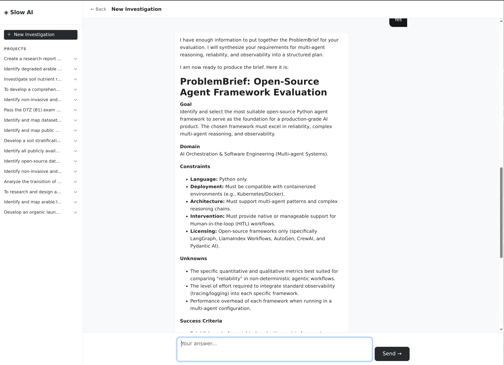
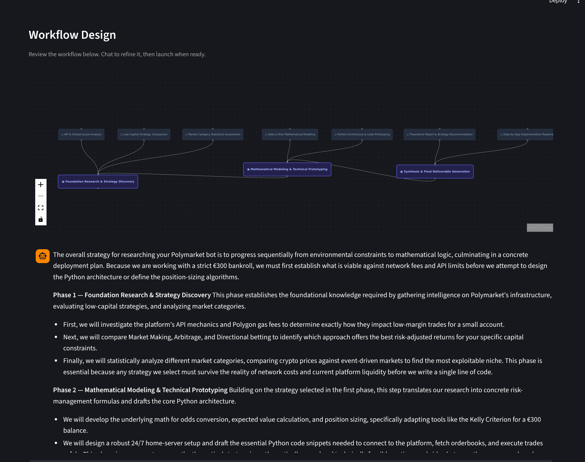
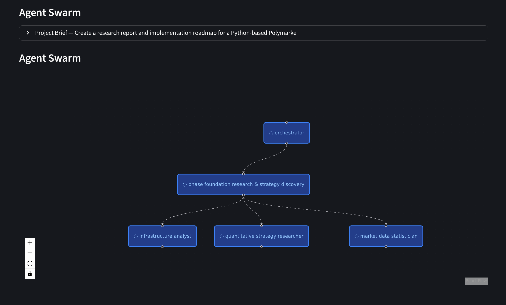
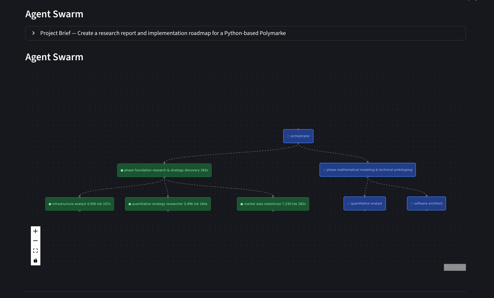
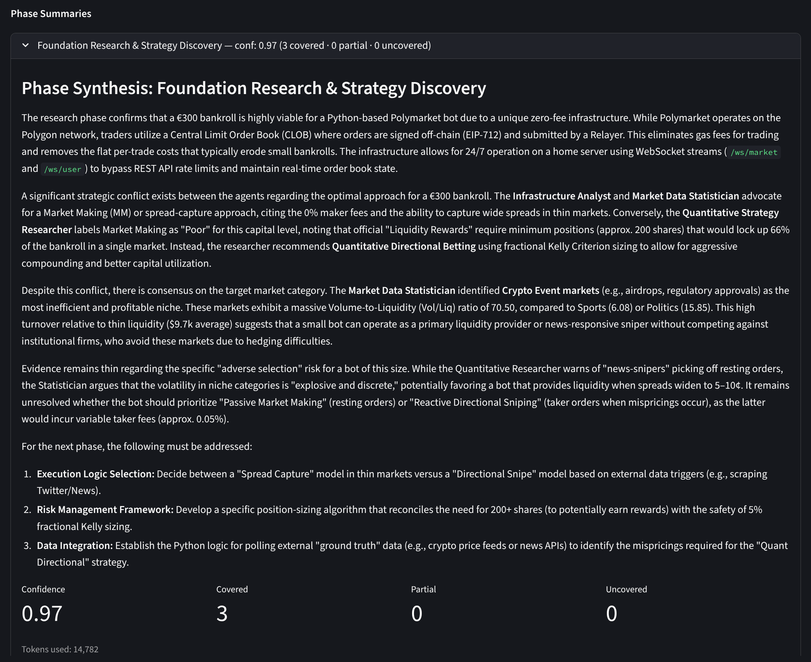
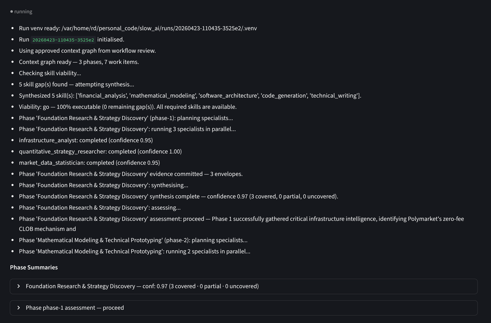

# Getting Started
{: .no_toc }

From zero to your first completed research run. No prior experience with agents required.
{: .fs-5 .fw-300 }

## Table of contents
{: .no_toc .text-delta }

1. TOC
{:toc}

---

## Before you begin

**What you need:**

| Requirement | Details |
|---|---|
| **Python 3.11+** | Check with `python3 --version` |
| **Git** | For cloning and the run audit trail |
| **Gemini API key** | Free tier works for exploration — [get one here](https://aistudio.google.com/app/apikey) |
| **Perplexity API key** | Powers live web search — [get one here](https://www.perplexity.ai/settings/api) |

{: .note }
> Perplexity is optional if your research doesn't require live web search. The system will still run — specialists will use web browsing and code execution instead.

**What you do not need:**
- Docker
- A database
- An account with any platform
- Anything beyond the two API keys above

---

## Installation

```bash
git clone https://github.com/ai-agents-for-humans/slow-ai
cd slow-ai
bash install.sh
```

The install script does four things in sequence:

1. **Checks your environment** — confirms Python 3.11+ is available
2. **Installs `uv`** — the fast Python package manager that powers sandboxed execution
3. **Installs dependencies** — `uv sync` pulls everything from `pyproject.toml`
4. **Configures your API keys** — prompts for Gemini and Perplexity keys, writes them to `.env`

Your keys are stored locally in `.env` and never leave your machine.

When it finishes you will see:

```
  ╔══════════════════════════════════════════════════════════╗
  ║                     you're ready                        ║
  ╚══════════════════════════════════════════════════════════╝

  Run the app
    uv run streamlit run main.py
```

---

## Start the app

```bash
uv run streamlit run main.py
```

This starts the Streamlit interface and opens it in your browser at `http://localhost:8501`.

You will see the Slow AI interface with a sidebar showing any prior projects and runs. On first launch it will be empty.

---

## Your first research run

### Step 1 — Start the interview

Click **New Investigation** in the sidebar. The interview begins immediately.

The interviewer agent will ask you questions to understand your research goal. Answer naturally — as if you were briefing a colleague who asked you to clarify what you actually need.

**What the interview is doing:**
- Identifying the domain and goal
- Clarifying scope (geography, timeframe, perspective)
- Surfacing assumptions you may not have articulated
- Producing a structured brief precise enough to plan against

**What good interview answers look like:**
- Be specific about *why* you need this — the purpose shapes what evidence matters
- Don't worry about framing it perfectly — the agent will push back if something is vague
- Answer one question at a time; don't pre-answer questions that haven't been asked

When the agent has enough, it will show you a structured **Problem Brief** for confirmation. Review it. If something is missing or wrong, tell the agent in plain language — it will revise and show you again.

When you're happy: click **Confirm Brief**.


Once the interview is complete, the agent synthesises your answers into a structured brief:


The confirmed brief captures your goal, domain, success criteria, and constraints as a typed, committed artifact. This is the contract — everything the system does from here is measured against it.



{: .highlight }
> **The brief is the cornerstone.** Everything that follows — the context graph, the agent assignments, the synthesis — is built on top of it. A five-minute interview is the highest-leverage thing the system does.

---

### Step 2 — Review the context graph

After confirming your brief, the planner agent generates a **context graph**: a structured breakdown of the research question into phases and parallel work items.

You will see:
- A visual graph rendered in the interface — phases as clusters, work items as nodes
- A narrative summary explaining the logic of the breakdown (300–500 words)
- A chat panel for refinement

**Read the narrative first.** It explains why the graph is structured the way it is — what the planner understood about your problem and how it chose to decompose it. If the narrative doesn't match your mental model of the work, that is the signal to refine.



**Refining the graph through conversation:**

You don't edit the graph directly — you tell the system what you want changed in plain language. This is one of the most important things to understand: the context graph is a shared mental model between you and the system, and conversation is how you align it.

You can change phases, add work items, adjust dependencies, or redirect the entire investigation — all through the chat panel alongside the graph.

```
  "The regulatory phase should come before the market sizing —
   reimbursement rules will constrain what's commercially viable."

  "Add a phase on patient advocacy groups — they're a key signal
   for how fast adoption moves in this market."

  "The competitive dynamics section is too broad.
   Split it into direct competitors and adjacent digital health players."

  "Remove the pricing phase entirely — the client already has this data."
```

Each message regenerates the graph and a new narrative summary explaining the updated structure. You can see exactly how your input changed the plan. Repeat until the shape of the work matches how an expert in your domain would approach it.

{: .note }
> **You are the expert.** The system proposes, you decide. The graph is not locked until you launch — take the time to get the direction right. A well-shaped graph produces dramatically better results than a vague one.

When you're satisfied: click **Launch Agent Swarm**.

{: .important }
> **The direction matters more than the detail.** You are approving the shape of the investigation, not the implementation. Trust that the agents will figure out the specifics — your job is to confirm the phases make sense and nothing critical is missing.

---

### Step 3 — Watch the swarm

After launch, the approved context graph drives the agent swarm. The live run view shows the agent DAG growing in real time — each work item from the graph becomes an agent node, executing in the order the graph defined.


**What you're seeing:**

| Node colour | Meaning |
|---|---|
| Grey | Waiting — dependency not yet satisfied |
| Blue / pulsing | Running — agent is actively working |
| Green | Complete — evidence envelope produced |
| Red | Failed or partial — agent flagged a gap |



Each node is clickable. Click any completed node to see the full evidence envelope: what the agent found, its confidence score, the sources it used, and what it couldn't determine.

**When a phase completes**, all its nodes turn green and the orchestrator pauses before opening the next wave. This is the phase boundary — synthesis happens here, confidence is assessed, and the next phase is briefed with what was just established.



**Phase summaries** appear at each boundary — a consolidated view of what that phase established, what it passed forward, and what the next phase will investigate.



The phase summary gives you full observability into what just happened:
- What each agent found and how confident it was
- How long each agent took and how many tokens it used
- What the synthesiser concluded from the phase as a whole
- What the next phase is planned to investigate, informed by what this phase found



This is what it means for the system to be inspectable. Not just a final answer — a live record of every decision, every finding, and every transition as the investigation unfolds.

You do not need to watch it run. You can close the browser and come back later. The run continues in the background and the state is always written to disk.

---

### Step 4 — Read the results and go deeper

When the run completes, everything is available across four tabs — and the conversation never has to stop.


**Conversation tab**

The run opens with a structured briefing — a narrative of what was found, phase by phase, with inline citations linking every claim to the specific agent envelope that produced it. Then you can keep talking.

```
  "Why was the reimbursement section scored lower than the others?"

  "Show me the evidence behind the claim about AMNOG timelines."

  "What would we need to add to get a fuller picture of the
   regulatory pathway?"
```

Every response is grounded in the evidence from the run — not general knowledge.

**Evidence tab**

The full agent DAG with every envelope inspectable. Click any node to see what that agent found, its confidence score (0–1), the sources it cited, and what it couldn't determine. The coverage overlay shows which parts of the context graph were fully covered, which were partial, and which weren't reached.

**Report tab**

A structured report synthesised from the full run — findings organised by phase, confidence levels surfaced, gaps called out explicitly. Exportable for sharing.

**Log tab**

The complete run log — every agent action, every tool call, timing per agent, tokens used, errors surfaced. Full observability from start to finish.

---

### Step 5 — Continue the investigation

The run doesn't have to end here. At the top of the post-run view, chaining options let you build directly on what was just found.

Click **Continue Investigation** and the system generates a follow-on brief from the current run's identified gaps — questions that surfaced but weren't answered. You review the new context graph (it will not duplicate work already done), confirm the direction, and launch.

The next run's specialists pull specific evidence from prior runs when their work item needs it. The understanding compounds.

```
  Run 1  →  Market landscape. Gaps: regulatory detail, pricing pressure.
  Run 2  →  Regulatory + pricing. Builds on Run 1. Gaps: competitive moat.
  Run 3  →  Competitive synthesis. Uses Runs 1 + 2. Strategic recommendation.
```

Each run starts smarter than the last. This is the loop that turns a one-off investigation into a compounding body of knowledge.

---

## Bring your own models

Out of the box, Slow AI uses Gemini models. To swap any model slot, edit `src/slow_ai/llm/registry.json`:

```json
{
  "models": [
    {
      "name": "reasoning",
      "model_id": "google-gla:gemini-2.5-pro",
      "use_for": ["context_planning", "orchestration", "assessment"]
    },
    {
      "name": "fast",
      "model_id": "google-gla:gemini-2.5-flash",
      "use_for": ["skill_synthesis", "report_synthesis", "interview"]
    },
    {
      "name": "code",
      "model_id": "google-gla:gemini-2.5-pro",
      "use_for": ["code_generation"]
    },
    {
      "name": "specialist",
      "model_id": "google-gla:gemini-2.5-pro",
      "use_for": ["specialist_research"]
    }
  ]
}
```

Change `model_id` to any supported provider. No code changes needed.

**Supported providers:**

| Provider | Example model_id |
|---|---|
| Google | `google-gla:gemini-2.5-pro` |
| OpenAI | `openai:gpt-4o` |
| Anthropic | `anthropic:claude-opus-4-5` |
| Ollama (local) | `ollama:qwen2.5-coder:7b` |
| vLLM / LM Studio | `openai:model-name` with custom base URL |

{: .highlight }
> **For regulated environments:** point every slot at a local Ollama instance. No data leaves your infrastructure. The agents do not know or care which provider they use.

---

## Understanding what's stored

Every run creates a directory under `runs/`:

```
runs/
  {run_id}/
    input_brief.json      ← the brief that started the run
    input_graph.json      ← the approved context graph
    envelopes/            ← one JSON file per specialist agent
    artefacts/            ← generated code, datasets, parsed documents
    live/                 ← real-time state files read by the UI
    conversation.jsonl    ← full history: interview, review, post-run chat
    runner.log            ← structured run log
```

Projects are stored under `output/`:

```
output/
  {project_id}/
    problem_brief.json
    runs.jsonl            ← index of all runs for this project
```

Everything is plain files. Nothing requires a running service to read. Open any envelope JSON to see exactly what an agent produced.

---

## Common questions

**The run is taking a long time — is it stuck?**

Check `runs/{run_id}/runner.log` for the most recent log entry. If agents are still writing to their envelopes, the run is active. Some research questions — especially those requiring document parsing or dataset analysis — take 10–20 minutes per phase.

**An agent failed — what now?**

Red nodes in the DAG indicate a failed or partial agent. Click the node to see the evidence envelope — it will include an error description and what the agent attempted. The run continues with whatever work items were not blocked by that failure.

**I want to add a new tool or API integration.**

Tools are added to `src/slow_ai/tools/`. A tool is a Python function decorated with the pydantic-ai tool pattern. Once added, create a corresponding entry in `src/slow_ai/skills/catalog/` as a `SKILL.md` file so the skill synthesiser can use it.

**Can I run it without the Streamlit UI?**

Yes. The execution plane runs independently:

```bash
uv run python -m slow_ai.research --brief path/to/brief.json --graph path/to/graph.json
```

The UI reads the files the runner writes. Any other reader — a script, a different UI, a React app — works the same way.

---

## What to investigate first

If you're not sure where to start, here are briefs that work well as first runs:

- A market or competitive question in your professional domain
- A medical or health question you've been meaning to research properly
- A technology evaluation — comparing frameworks, libraries, or approaches
- A regulatory or policy question in a domain you know

The interview will help you get the brief right regardless of where you start. The more specific your problem, the sharper the context graph — and the more useful the output.

[Read how it works in depth](how-it-works){: .btn }
[Explore the architecture](architecture){: .btn }
