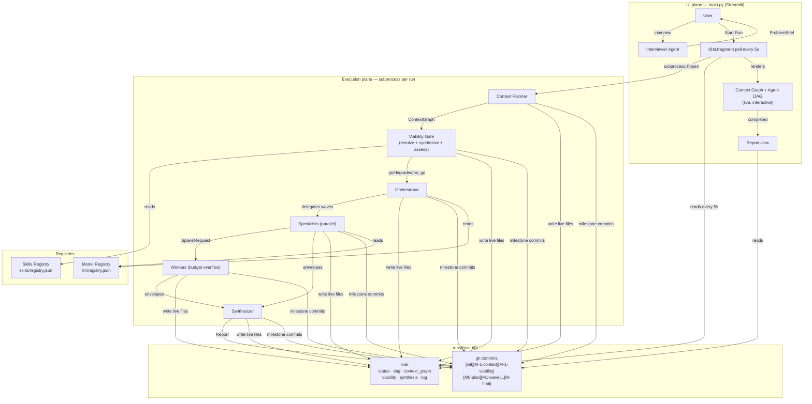

# Slow AI — Technical Documentation

Full architecture, agent specifications, data models, execution layer, and
configuration reference.

---

## Table of Contents

- [Architecture Overview](#architecture-overview)
- [Pipeline Stages](#pipeline-stages)
- [Skills Registry](#skills-registry)
- [Model Registry — BYOM](#model-registry--byom)
- [Viability Gate](#viability-gate)
- [Agents](#agents)
- [Tools](#tools)
- [Data Models](#data-models)
- [Execution Layer](#execution-layer)
- [UI](#ui)
- [Configuration](#configuration)
- [Status](#status)

---

## Architecture Overview

Two independent planes sharing nothing except files on disk:



**Key contract:** the execution plane writes plain JSON to `runs/{run_id}/live/`.
Streamlit polls those files via `@st.fragment(run_every="5s")`. No shared state,
no threading, no asyncio coupling. Any future UI (React, CLI) can replace Streamlit
without touching the execution plane.

---

## Pipeline Stages

The pipeline is domain-agnostic. The brief describes the work; the context planner
decomposes it into a skill-annotated graph; specialists execute using whatever tools
the registry provides.

```
Interview → ProblemBrief confirmed
  │
  ▼
run_context_planner(brief)                    ← reasoning model
  │  Produces ContextGraph
  │  Each WorkItem declares required_skills
  │  Committed as [M-1-context]
  ▼
Viability Gate
  │  1. resolve_skills() — structural BFS, finds gaps
  │  2. synthesize_skills() — LLM maps gaps to existing tools
  │     Writes new skills to registry.json immediately
  │  3. resolve_skills() — re-run with expanded registry
  │  4. viability_assess() — semantic go/degraded/no_go decision
  │  Committed as [M-1-viability]
  │
  ├── no_go (coverage = 0%) → write capability_checkpoint.json
  │                            status = blocked_on_capabilities
  │                            STOP
  │
  └── go / degraded → build working_graph (executable items only)
  │
  ▼
run_orchestrator(brief, working_graph, ready_items)   ← reasoning model
  │  Produces Plan (wave 1 specialists)
  │  Each specialist gets tools resolved from required_skills
  │  Committed as [M0-plan]
  ▼
┌──────────────────────────────────────────────────────┐
│  WAVE LOOP (max 5 waves, circuit breaker)            │
│                                                      │
│  Run specialists in parallel                         │
│    web_search → perplexity_search tool               │
│    web_browse → web_browse tool                      │
│    code_execution → generate_code() + execute()      │
│  Commit [M{N}-wave] — envelopes + artefacts + .py    │
│                                                      │
│  orchestrator_assess(brief, graph, envelopes, ready) │
│  Commit [M{N}-assessment]                            │
│                                                      │
│  synthesize → exit                                   │
│  spawn_specialists → next wave                       │
│  escalate_to_human → checkpoint + pause              │
└──────────────────────────────────────────────────────┘
  │
  ▼
Synthesizer → Report
Committed as [M-final-report]
status = completed
```

---

## Skills Registry

`src/slow_ai/skills/registry.json`

Skills are abstract abilities. Tools are concrete implementations. Work items declare
the skills they require. The registry maps skills to the tools that implement them.

```json
{
  "skills": [
    {
      "name": "web_search",
      "description": "Search the web using natural language queries.",
      "tools": ["perplexity_search"],
      "source": "built-in"
    },
    {
      "name": "code_execution",
      "description": "Execute arbitrary Python in an isolated subprocess.",
      "tools": ["code_execution"],
      "source": "built-in"
    },
    {
      "name": "statistical_analysis",
      "description": "Statistical tests and modelling using scipy/pandas.",
      "tools": ["code_execution"],
      "source": "synthesized"
    }
  ]
}
```

**Skill resolution at dispatch time:** `work_item.required_skills` → registry →
`tools_for_skills()` → `AgentContext.tools_available`. Agents only receive the
tools their work item actually needs.

**Skill synthesis:** when a skill gap is detected, the synthesizer agent attempts
to map the missing skill to existing tools. Synthesized entries are written back
to `registry.json` immediately and persist across runs.

**Adding external skills:** add a JSON entry to `registry.json`. No code changes
required. Future support for pulling skill definitions from open source repositories
(openclaw, nemoclaw, opencode) and MCP servers.

---

## Model Registry — BYOM

`src/slow_ai/llm/registry.json`

Every agent resolves its model from the registry by task type. No model IDs are
hardcoded in agent code.

```json
{
  "models": [
    {
      "name": "reasoning",
      "model_id": "google-gla:gemini-3.1-pro-preview",
      "provider": "google",
      "use_for": ["context_planning", "orchestration", "assessment", "viability_assess"]
    },
    {
      "name": "fast",
      "model_id": "google-gla:gemini-3-flash-preview",
      "provider": "google",
      "use_for": ["skill_synthesis", "report_synthesis", "interview"]
    },
    {
      "name": "code",
      "model_id": "google-gla:gemini-3.1-pro-preview",
      "provider": "google",
      "use_for": ["code_generation"]
    }
  ]
}
```

**Supported provider types:**

| Provider | Format | Notes |
|---|---|---|
| `google` | `google-gla:model-id` | Native pydantic_ai Google provider |
| `openai` | `openai:model-id` | Native pydantic_ai OpenAI provider |
| `anthropic` | `anthropic:model-id` | Native pydantic_ai Anthropic provider |
| `openai_compatible` | any model name | Ollama, vLLM, LM Studio, any custom endpoint |

**Running a local model (e.g. Qwen via Ollama):**

```json
{
  "name": "qwen_code",
  "model_id": "qwen2.5-coder:7b",
  "provider": "openai_compatible",
  "base_url": "http://localhost:11434/v1",
  "api_key": "ollama",
  "use_for": ["code_generation"]
}
```

Add the entry, restart the app. No code changes.

**Task → model routing:**

| Task | Model tier | Why |
|---|---|---|
| `context_planning` | reasoning | Complex goal decomposition |
| `orchestration` | reasoning | Wave planning, dependency analysis |
| `assessment` | reasoning | Coverage evaluation, next-wave decisions |
| `viability_assess` | reasoning | Semantic gap judgment |
| `specialist_research` | reasoning | Multi-turn research with tool use |
| `code_generation` | code | Dedicated slot — swap to specialist without touching agents |
| `skill_synthesis` | fast | Straightforward skill-to-tool mapping |
| `report_synthesis` | fast | Structured summarisation |
| `interview` | fast | Conversational brief elicitation |

---

## Viability Gate

Before a single wave fires, the viability gate checks whether the planned work can
actually be executed with the skills currently in the registry.

```
resolve_skills(graph, registry)
  → gap items (direct missing skills)
  → all_blocked items (gap items + transitive dependents via BFS)
  → SkillGap objects (per missing skill, with downstream impact)

if gaps:
    synthesize_skills(gaps, registry)
      → synthesized skills written to registry.json immediately
      → needs_new_tool: GitHub search queries for unresolvable gaps
    resolve_skills(graph, registry)   ← re-run with expanded registry

viability_assess(brief, graph, executable_ids, blocked_ids, gaps)
  → "go"       — all skills available
  → "degraded" — some gaps remain, but sufficient work can proceed
                 blocked items committed to paths/not_taken/
                 working_graph filtered to executable items only
  → "no_go"    — coverage = 0%, nothing can execute, run aborted
```

**Hard rule:** if any items are executable (coverage > 0%), the system always runs
in at least `degraded` mode. `no_go` only fires when literally nothing can execute.

The viability decision is committed to git as `[M-1-viability]` — the gap record
accumulates across runs and becomes a durable capability backlog.

---

## Agents

### Interviewer
| Property | Value |
|---|---|
| Model | `fast` (from registry) |
| Output | `str \| ProblemBrief` |
| File | `src/slow_ai/agents/interviewer.py` |

Conducts a structured conversation — one question at a time, pushing back on
vagueness, surfacing assumptions — until a complete `ProblemBrief` is confirmed.
The brief is the first git commit and the contract the entire run executes against.

### Context Planner
| Property | Value |
|---|---|
| Model | `reasoning` (from registry) |
| Output | `ContextGraph` |
| File | `src/slow_ai/agents/orchestrator.py` |

Decomposes the brief into a directed graph of work items. Each item declares
`required_skills`. The planner is given the current skill registry as context but
is explicitly instructed to plan ideally — declaring skills that don't exist yet.
Gaps surface in the viability gate rather than being silently omitted.

### Orchestrator
| Property | Value |
|---|---|
| Model | `reasoning` (from registry) |
| Output | `ResearchPlan` |
| File | `src/slow_ai/agents/orchestrator.py` |

Assigns specialist agents to the current wave's ready work items. Dependency
ordering is enforced in code via `_ready_work_items(graph, covered)` — not left
to the LLM.

### Specialist
| Property | Value |
|---|---|
| Model | `specialist_research` (from registry) |
| Output | `EvidenceEnvelope` |
| File | `src/slow_ai/agents/specialist.py` |

Built dynamically from an `AgentContext`. Receives only the tools that correspond
to its work item's required skills:

| Tool | Registered when |
|---|---|
| `search(query)` | skill includes `perplexity_search` |
| `browse(url)` | skill includes `web_browse` |
| `generate_code(description)` | skill includes `code_execution` |
| `execute(code)` | skill includes `code_execution` |

For code execution work items: `generate_code()` first (uses the `code` model,
saves `.py` to artefacts directory), then `execute()`. Generated code is committed
to git alongside the outputs it produced.

Returns an `EvidenceEnvelope` with proof, verdict, confidence, and artefact
filenames. All specialists in a wave run concurrently via `asyncio.gather()`.

### Synthesizer
| Property | Value |
|---|---|
| Model | `report_synthesis` (from registry) |
| Output | `ResearchReport` |
| File | `src/slow_ai/research/runner.py` |

Receives all evidence envelopes, deduplicates findings, scores on quality, ranks,
and writes a summary. Committed as `[M-final-report]`.

---

## Tools

### `perplexity_search(query) → PerplexityResult`
`src/slow_ai/tools/perplexity.py`

Calls the Perplexity `sonar` model. Returns a synthesised answer and citation URLs.

### `web_browse(url, max_chars=4000) → BrowseResult`
`src/slow_ai/tools/web_browse.py`

Fetches a URL with `httpx`, strips boilerplate with `BeautifulSoup`, returns up to
4 000 characters of body text.

### `code_execution(code, timeout=30, working_dir=None) → dict`
`src/slow_ai/tools/code_execution.py`

Runs Python code in an isolated subprocess with a configurable timeout.
`working_dir` is set to the agent's artefacts directory so generated files land
in the correct location for git commit. Returns `{success, stdout, stderr}`.

### `generate_python_code(task_description, context, save_to_dir) → GeneratedCode`
`src/slow_ai/tools/code_generation.py`

Calls the `code_generation` model to produce complete, runnable Python. Saves the
`.py` file to `save_to_dir` before returning. Returns `{code, filename, description}`.
The code file is always committed to git alongside the outputs it produced.

---

## Data Models

Key models in `src/slow_ai/models.py`:

| Model | Purpose |
|---|---|
| `ProblemBrief` | Confirmed goal, domain, constraints, unknowns, success criteria |
| `WorkItem` | Node in the context graph — includes `required_skills` |
| `ContextGraph` | Goal + work items + dependency edges |
| `SkillGap` | Missing skill, which items need it, downstream impact, critical path flag |
| `ViabilityDecision` | go/degraded/no_go + gaps + blocked/executable items + reasoning |
| `SynthesizedSkill` | New skill entry produced by the synthesizer |
| `SkillSynthesisResult` | Synthesized skills + unresolvable gaps + GitHub search queries |
| `AgentContext` | Per-agent runtime context — role, task, memory, tools, artefacts_dir |
| `AgentMemory` | Accumulated memory entries with token budget tracking |
| `EvidenceEnvelope` | Agent output — proof, verdict, confidence, artefact filenames |
| `OrchestratorDecision` | Assessment result — covered/pending/escalated + next wave |
| `ResearchPlan` | Wave 1 specialist assignments |
| `ResearchReport` | Final synthesised output |

---

## Execution Layer

### GitStore — `src/slow_ai/execution/git_store.py`

Every run is a git repository at `runs/{run_id}/`. Milestone commits:

| Commit | Contents |
|---|---|
| `[init]` | `problem_brief.json` |
| `[M-1-context]` | `context_graph.json` |
| `[M-1-viability]` | `viability.json`, `skill_synthesis.json` |
| `[M0-plan]` | `research_plan.json`, `registry.json` |
| `[M{N}-wave]` | `envelopes/wave{N}/*.json`, `artefacts/wave{N}/` |
| `[M{N}-assessment]` | `assessments/wave{N}.json` |
| `[M-final-report]` | `report.json` |
| `[skipped]` | `paths/not_taken/*.json` |

Live files updated on every status change (untracked, not committed):

| File | Contains |
|---|---|
| `status.json` | `initializing \| running \| completed \| failed \| blocked_on_capabilities` |
| `dag.json` | Live agent DAG (nodes + edges + tokens + durations) |
| `context_graph.json` | Work items with coverage overlay data |
| `viability.json` | Viability decision + skill gaps |
| `synthesis.json` | Skill synthesis results |
| `assessment.json` | Latest orchestrator assessment |
| `log.jsonl` | Append-only progress log |
| `capability_checkpoint.json` | Written on no_go — gap details for resolution |

### AgentRegistry — `src/slow_ai/execution/registry.py`

In-memory control plane. Tracks every agent across its full lifecycle with lineage,
status, token usage, and memory paths. Committed to git as `registry.json` at each
milestone. `get_dag()` produces the full agent tree for UI rendering.

---

## UI

`main.py` — single-page Streamlit app. Thin by design — no knowledge of execution
internals. Launches a subprocess and reads files.

**Context graph** — shows the work blueprint with a coverage overlay:

| Style | Meaning |
|---|---|
| Grey (○) | Not yet worked |
| Blue (◌) | Agent currently running |
| Green (●) | Covered — confidence ≥ 0.6 |
| Orange (◑) | Partial — confidence 0.3–0.59 |
| Red dashed (⊘) | Skill gap — missing capability |

**Agent DAG** — live during execution, interactive after completion. Click any node
to inspect its evidence envelope, memory entries, and raw artefacts.

**Viability panel** — when a run is degraded or blocked, surfaces the skill gaps,
what was synthesized, what remains unresolvable, and suggested GitHub searches.

**Sidebar** — saved projects with all historical runs, live status badges, and
one-click load for any previous run.

---

## Configuration

Copy `.env.example` to `.env`:

```
GEMINI_API_KEY=...
PERPLEXITY_KEY=...
```

Settings loaded via `pydantic-settings` from `src/slow_ai/config.py`.

To add or change models: edit `src/slow_ai/llm/registry.json`.
To add skills: edit `src/slow_ai/skills/registry.json`.
No code changes required for either.

```bash
uv run streamlit run main.py
```

---

## Status

| Component | State |
|---|---|
| Interviewer agent | Working |
| Context planner (skill-aware) | Working |
| Skills registry + resolution | Working |
| Skill synthesizer (gap → registry) | Working |
| Viability gate (go/degraded/no_go) | Working |
| Model registry (BYOM) | Working |
| Orchestrator (dependency-aware waves) | Working |
| Specialist — web_search | Working |
| Specialist — web_browse | Working |
| Specialist — code_execution | Working |
| Specialist — code generation (LLM) | Working |
| Artefacts in correct run directory | Working |
| Generated .py files committed to git | Working |
| GitStore milestone commits | Working |
| AgentRegistry + live DAG | Working |
| Context graph UI + coverage overlay | Working |
| Skill gap UI (⊘ nodes, viability panel) | Working |
| Synthesis agent | Working |
| Run history + sidebar | Working |
| Human-in-the-loop (escalate_to_human) | Partial — checkpoint written, resume not yet implemented |
| MAPE-K observer / circuit breaker | Planned — V2 |
