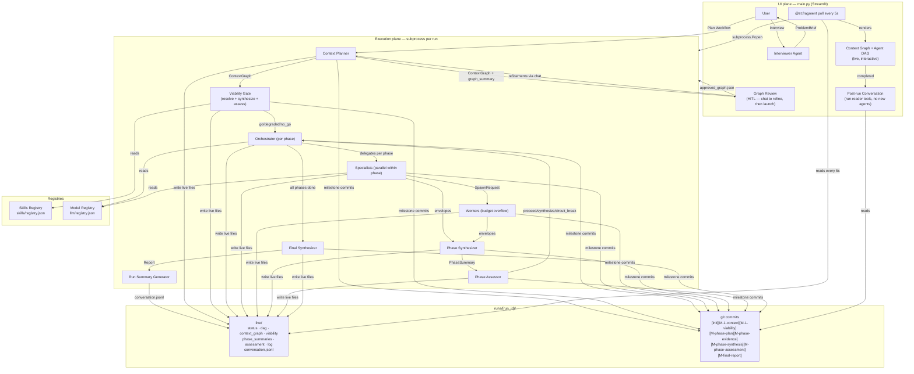

# Slow AI — Technical Documentation

Full architecture, agent specifications, data models, execution layer, and
configuration reference.

---

## Table of Contents

- [Architecture Overview](#architecture-overview)
- [Pipeline Stages](#pipeline-stages)
- [Human-in-the-Loop Workflow Review](#human-in-the-loop-workflow-review)
- [Phase Execution Model](#phase-execution-model)
- [Run Chaining](#run-chaining)
- [Sandboxed Code Execution](#sandboxed-code-execution)
- [Skills Registry](#skills-registry)
- [Model Registry — BYOM](#model-registry--byom)
- [Viability Gate](#viability-gate)
- [Agents](#agents)
- [Tools](#tools)
- [Data Models](#data-models)
- [Execution Layer](#execution-layer)
- [Logging](#logging)
- [UI](#ui)
- [Configuration](#configuration)
- [Status](#status)

---

## Architecture Overview

Two independent planes sharing nothing except files on disk:



**Key contract:** the execution plane writes plain JSON to `runs/{run_id}/live/`.
Streamlit polls those files via `@st.fragment(run_every="5s")`. No shared state,
no threading, no asyncio coupling between planes. Any future UI (React, CLI) can
replace Streamlit without touching the execution plane.

---

## Pipeline Stages

```
Interview → ProblemBrief confirmed
  │
  ▼
Plan Workflow (in UI process)
  │  run_context_planner(brief) → ContextGraph
  │  generate_graph_summary(brief, graph) → narrative
  │  Graph review chat — user refines, launches
  │  approved_graph.json written to runs/{run_id}/
  ▼
─── subprocess boundary ──────────────────────────────────────
  │
  ▼
run_context_planner(brief)         ← skipped if approved_graph exists
  │  Produces ContextGraph
  │  Each Phase contains parallel WorkItems
  │  Each WorkItem declares required_skills
  │  Committed as [M-1-context]
  ▼
Viability Gate
  │  1. resolve_skills() — BFS gap detection
  │  2. synthesize_skills() — LLM maps gaps to existing tools
  │     Writes new skills to registry.json immediately
  │  3. resolve_skills() — re-run with expanded registry
  │  4. viability_assess() — semantic go/degraded/no_go decision
  │  Committed as [M-1-viability]
  │
  ├── no_go (coverage = 0%) → capability_checkpoint.json
  │                           status = blocked_on_capabilities
  │                           STOP
  │
  └── go / degraded → working_graph (executable items only)
  │
  ▼
┌──────────────────────────────────────────────────────────────┐
│  PHASE LOOP (max 8 phases, circuit breaker)                  │
│                                                              │
│  run_orchestrator(brief, phase, graph)                       │
│    → ResearchPlan: one specialist per work item              │
│    → committed as [M-{phase.id}-plan]                        │
│                                                              │
│  Run all specialists in parallel (asyncio.gather)            │
│    web_search   → perplexity_search (with retry)             │
│    web_browse   → web_browse (with retry)                    │
│    url_fetch    → fetch_url                                  │
│    code_exec    → generate_code() + execute() (sandboxed)    │
│    prior_runs   → read_prior_evidence() when chain exists    │
│    committed as [M-{phase.id}-evidence]                      │
│                                                              │
│  synthesise_phase(phase, envelopes, brief)                   │
│    → PhaseSummary: narrative + coverage + confidence         │
│    → committed as [M-{phase.id}-synthesis]                   │
│    → written to live/phase_summaries.json                    │
│                                                              │
│  orchestrator_assess(brief, graph, phase, summary)           │
│    → OrchestratorDecision                                    │
│    → committed as [M-{phase.id}-assessment]                  │
│                                                              │
│  proceed        → next phase                                 │
│  synthesize     → exit loop (all key questions answered)     │
│  circuit_break  → exit loop (confidence < 0.15, 0 covered)  │
│  escalate_to_human → checkpoint + status=waiting_for_human  │
└──────────────────────────────────────────────────────────────┘
  │
  ▼
Final Synthesizer → ResearchReport
  committed as [M-final-report]
  │
  ▼
generate_run_summary(brief, phase_summaries, envelopes)
  → Perplexity-style markdown with inline agent citations
  → saved to live/conversation.jsonl as opening chat message
  │
  ▼
status = completed
```

---

## Human-in-the-Loop Workflow Review

Before any agents run, the user reviews and optionally refines the planned
workflow through a conversational interface. This is a full HITL gate.

**Flow:**

1. User clicks **Plan Workflow** → `run_context_planner` runs in the UI process
2. `generate_graph_summary` produces a phase-by-phase narrative explaining what
   each phase will do and why it is relevant to the research goal
3. The context graph renders alongside the narrative in a chat interface
4. User can type refinements in plain language ("merge phases 2 and 3",
   "add a phase for sentiment analysis") → `run_graph_editor` updates the graph
5. Each refinement triggers a fresh `generate_graph_summary` — the user always
   sees a complete explanation of the current state, not just a diff
6. When satisfied, user clicks **Launch Agent Swarm** → `approved_graph.json` is
   written and the subprocess starts; the launch button disappears immediately

**Session state pattern:**

```
swarm_launching = True   (set by button click → st.rerun)
  ↓ top-of-page handler fires before any UI renders
_start_research(...)
swarm_launching = False
current_run_id = run_id
st.rerun()               (now renders live panel, button is gone)
```

This two-render pattern prevents any window where the launch button can be
clicked twice. The transition render produces no UI output.

**Graph editor** (`run_graph_editor`): takes the current graph and user feedback
as input, returns a refined `ContextGraph`. Preserves correct elements; changes
only what the user requested.

---

## Phase Execution Model

Work is structured as a sequence of **phases**, each containing **work items**
that run in parallel. Phases have explicit dependencies (`depends_on_phases`) and
are executed in topological order.

```
Phase 1 — Landscape Scan
  ├── wi-1-1  Market overview           [web_search]
  ├── wi-1-2  Regulatory landscape      [web_search, web_browse]
  └── wi-1-3  Key player identification [web_search]

Phase 2 — Deep Investigation    (depends on Phase 1)
  ├── wi-2-1  Data source mapping       [url_fetch, code_execution]
  └── wi-2-2  Regulatory detail         [web_browse, pdf_extraction]

Phase 3 — Synthesis             (depends on Phase 2)
  └── wi-3-1  Cross-source analysis     [code_execution]
```

**Within a phase:** all work items run concurrently via `asyncio.gather()`.
One specialist agent per work item. Specialists receive only the tools their
work item's required skills map to.

**Phase synthesis:** after all specialists in a phase complete, `synthesise_phase`
produces a `PhaseSummary` with:
- LLM-generated narrative (what was found, contradictions, gaps, handoff notes)
- Coverage breakdown: covered (conf ≥ 0.6) / partial (0.3–0.59) / uncovered (< 0.3)
- Mean confidence score across all agents in the phase
- Total token usage

**Phase assessment:** `orchestrator_assess` reads the phase summary and decides:

| Decision | Condition | Effect |
|---|---|---|
| `proceed` | Sufficient evidence, next phase can start | Loop continues |
| `synthesize` | All key questions answered | Skip remaining phases |
| `circuit_break` | Conf < 0.15 AND zero covered items | Abort with logged reason |
| `escalate_to_human` | Critical ambiguity requires human call | Pause + checkpoint |

A hard circuit breaker in code overrides the LLM decision if `mean_confidence < 0.15`
and `covered_item_ids` is empty — prevents continuing on garbage data.

---

## Run Chaining

Runs can be chained so that later runs build on the evidence gathered by earlier
ones. Prior run IDs are stored in `ProblemBrief.prior_run_ids`.

**Three continuation paths (post-run UI):**

| Button | Behaviour |
|---|---|
| **Do what we didn't finish** | `generate_follow_on_brief` analyses uncovered/partial items from phase summaries and produces a new brief targeting the gaps. Automatically sets `prior_run_ids`. Immediately enters graph review with the new brief. |
| **Dig deeper** | Resets to the interview. User describes the new direction. Prior run ID is injected into the brief when confirmed. |
| **Plan a New Workflow** | Keeps the current brief, discards prior run context, plans a fresh graph. |

**Prior context injection:** when `prior_run_ids` is non-empty, `_load_prior_context`
reads phase summaries from all prior runs and injects them into the context planner
prompt. The planner is instructed not to repeat covered work.

**`generate_follow_on_brief`:** an LLM agent that reads the original brief and
completed phase summaries, identifies gaps and contradictions, and produces a new
`ProblemBrief` focused exclusively on unresolved questions. Inherits domain,
constraints, and overall goal from the original.

**`read_prior_evidence` tool:** registered on specialists when `ctx.prior_run_ids`
is non-empty. Calls `search_across_runs` to search phase syntheses and evidence
envelopes across all prior runs in the chain. Specialists are instructed to call
this first to avoid repeating covered ground.

---

## Sandboxed Code Execution

Every run gets its own isolated Python virtual environment created with `uv`.

**Venv lifecycle:**
```
setup_run_venv(run_id)
  → uv venv runs/{run_id}/.venv
  → uv pip install [seed packages]   ← pandas, numpy, scipy, matplotlib,
                                        seaborn, plotly, requests, httpx,
                                        beautifulsoup4, lxml, pdfplumber,
                                        openpyxl, pyarrow, networkx,
                                        scikit-learn, bandit
  → returns absolute venv path
```

Idempotent — safe to call multiple times; returns immediately if venv exists.
The absolute path is stored in `AgentContext.venv_path` and passed to every
`execute()` call in that run.

**Security scanning (bandit):**

Every piece of code is scanned before execution:

| Severity | Behaviour |
|---|---|
| HIGH | Hard block — code is not executed, error returned to agent |
| MEDIUM | Warning prepended to stdout, execution proceeds |
| LOW | Silent, execution proceeds |

Agents can install additional packages inside `execute()` via `pip install`.
The venv is run-scoped — packages installed in one run do not affect others.

**Path resolution:** `asyncio.create_subprocess_exec` resolves relative executable
paths relative to `cwd` (the artefacts directory), not the process CWD. All venv
python paths are stored and used as absolute paths via `.resolve()`.

---

## Skills Registry

`src/slow_ai/skills/registry.json`

Skills are abstract abilities. Tools are concrete implementations. Work items declare
the skills they require. The registry maps skills to the tools that implement them.

```json
{
  "skills": [
    {
      "name": "web_search",
      "description": "Search the web using natural language queries.",
      "tools": ["perplexity_search"],
      "source": "built-in"
    },
    {
      "name": "code_execution",
      "description": "Execute arbitrary Python in an isolated subprocess.",
      "tools": ["code_execution"],
      "source": "built-in"
    },
    {
      "name": "statistical_analysis",
      "description": "Statistical tests and modelling using scipy/pandas.",
      "tools": ["code_execution"],
      "source": "synthesized"
    }
  ]
}
```

**Skill resolution at dispatch time:** `work_item.required_skills` → registry →
`tools_for_skills()` → `AgentContext.tools_available`. Agents only receive the
tools their work item actually needs.

**Skill synthesis:** when a skill gap is detected, the synthesizer agent attempts
to map the missing skill to existing tools. Synthesized entries are written back
to `registry.json` immediately and persist across runs.

**Adding external skills:** add a JSON entry to `registry.json`. No code changes
required. Future support for pulling skill definitions from open source repositories
and MCP servers.

---

## Model Registry — BYOM

`src/slow_ai/llm/registry.json`

Every agent resolves its model from the registry by task type. No model IDs are
hardcoded in agent code.

```json
{
  "models": [
    {
      "name": "reasoning",
      "model_id": "google-gla:gemini-3.1-pro-preview",
      "provider": "google",
      "use_for": ["context_planning", "orchestration", "assessment", "viability_assess"]
    },
    {
      "name": "fast",
      "model_id": "google-gla:gemini-3-flash-preview",
      "provider": "google",
      "use_for": ["skill_synthesis", "report_synthesis", "interview"]
    },
    {
      "name": "code",
      "model_id": "google-gla:gemini-3.1-pro-preview",
      "provider": "google",
      "use_for": ["code_generation"]
    }
  ]
}
```

**Supported provider types:**

| Provider | Format | Notes |
|---|---|---|
| `google` | `google-gla:model-id` | Native pydantic_ai Google provider |
| `openai` | `openai:model-id` | Native pydantic_ai OpenAI provider |
| `anthropic` | `anthropic:model-id` | Native pydantic_ai Anthropic provider |
| `openai_compatible` | any model name | Ollama, vLLM, LM Studio, any custom endpoint |

**Running a local model (e.g. Qwen via Ollama):**

```json
{
  "name": "qwen_code",
  "model_id": "qwen2.5-coder:7b",
  "provider": "openai_compatible",
  "base_url": "http://localhost:11434/v1",
  "api_key": "ollama",
  "use_for": ["code_generation"]
}
```

Add the entry, restart the app. No code changes.

**Task → model routing:**

| Task | Model tier | Why |
|---|---|---|
| `context_planning` | reasoning | Complex goal decomposition |
| `orchestration` | reasoning | Phase planning, specialist assignment |
| `assessment` | reasoning | Coverage evaluation, continuation decision |
| `viability_assess` | reasoning | Semantic gap judgment |
| `specialist_research` | reasoning | Multi-turn research with tool use |
| `code_generation` | code | Dedicated slot — swap to specialist without touching agents |
| `skill_synthesis` | fast | Straightforward skill-to-tool mapping |
| `report_synthesis` | fast | Structured summarisation |
| `interview` | fast | Conversational brief elicitation |

---

## Viability Gate

Before a single specialist runs, the viability gate checks whether the planned
work can actually be executed with the skills currently in the registry.

```
resolve_skills(graph, registry)
  → gap items (direct missing skills)
  → all_blocked items (gap items + transitive dependents via BFS)
  → SkillGap objects (per missing skill, with downstream impact)

if gaps:
    synthesize_skills(gaps, registry)
      → synthesized skills written to registry.json immediately
      → needs_new_tool: GitHub search queries for unresolvable gaps
    resolve_skills(graph, registry)   ← re-run with expanded registry

viability_assess(brief, graph, executable_ids, blocked_ids, gaps)
  → "go"       — all skills available
  → "degraded" — some gaps remain, but sufficient work can proceed
                 blocked items committed to paths/not_taken/
                 working_graph filtered to executable items only
  → "no_go"    — coverage = 0%, nothing can execute, run aborted
```

**Hard rule:** if any items are executable (coverage > 0%), the system always
runs in at least `degraded` mode. `no_go` only fires when literally nothing can
execute.

The viability decision is committed to git as `[M-1-viability]` — the gap record
accumulates across runs and becomes a durable capability backlog.

---

## Agents

### Interviewer
| Property | Value |
|---|---|
| Model | `fast` |
| Output | `str \| ProblemBrief` |
| File | `src/slow_ai/agents/interviewer.py` |

Conducts a structured conversation — one question at a time, pushing back on
vagueness, surfacing assumptions — until a complete `ProblemBrief` is confirmed.
The brief is the first git commit and the contract the entire run executes against.
Accepts file attachments (PDF, CSV) as additional context.

### Context Planner
| Property | Value |
|---|---|
| Model | `reasoning` |
| Output | `ContextGraph` |
| File | `src/slow_ai/agents/orchestrator.py` → `run_context_planner` |

Decomposes the brief into phases of parallel work items. Each item declares
`required_skills`. The planner is given the current skill registry as context but
is explicitly instructed to plan ideally — declaring skills that don't exist yet.
Gaps surface in the viability gate rather than being silently omitted.

When `prior_run_ids` are present, phase summaries from those runs are injected
into the prompt. The planner is instructed to target uncovered/partial work only.

### Graph Editor
| Property | Value |
|---|---|
| Model | `reasoning` |
| Output | `ContextGraph` |
| File | `src/slow_ai/agents/orchestrator.py` → `run_graph_editor` |

Refines an existing `ContextGraph` based on user feedback. Receives the current
graph and feedback text; preserves elements that are correct, changes only what
the user requests. Called on each chat message during graph review.

### Graph Summary Agent
| Property | Value |
|---|---|
| Model | `reasoning` |
| Output | `str` (markdown) |
| File | `src/slow_ai/agents/orchestrator.py` → `generate_graph_summary` |

Generates a 300–500 word phase-by-phase narrative explaining what the planned
workflow will do and why each phase is relevant to the research goal. Called
after every context plan or graph edit — the user always sees a complete
explanation of the current state before launching. Ends with a prompt asking
the user to refine or proceed.

### Orchestrator
| Property | Value |
|---|---|
| Model | `reasoning` |
| Output | `ResearchPlan` |
| File | `src/slow_ai/agents/orchestrator.py` → `run_orchestrator` |

Called once per phase. Assigns one specialist per work item in the phase.
Sets roles, goals, evidence requirements, and context budgets. Dependency
ordering across phases is enforced in code via topological sort — not left to
the LLM.

### Specialist
| Property | Value |
|---|---|
| Model | `specialist_research` |
| Output | `EvidenceEnvelope` |
| File | `src/slow_ai/agents/specialist.py` |

Built dynamically from an `AgentContext`. Receives only the tools that correspond
to its work item's required skills:

| Tool registered as | Registered when |
|---|---|
| `search(query)` | `perplexity_search` in skills |
| `browse(url)` | `web_browse` in skills |
| `fetch_url(url)` | `url_fetch` in skills |
| `generate_code(description)` | `code_execution` in skills |
| `execute(code)` | `code_execution` in skills |
| `read_prior_evidence(topic)` | `ctx.prior_run_ids` is non-empty |

All specialists in a phase run concurrently via `asyncio.gather()`.

Returns an `EvidenceEnvelope` with proof, verdict, confidence, artefact filenames,
and optional `SpawnRequest` for budget overflow workers.

### Phase Synthesizer
| Property | Value |
|---|---|
| Model | `report_synthesis` |
| Output | `PhaseSummary` |
| File | `src/slow_ai/agents/orchestrator.py` → `synthesise_phase` |

Runs after every phase completes. Produces a narrative synthesis (3–8 paragraphs)
summarising findings across all work items, noting contradictions, gaps, and what
the next phase needs to know. Classifies each work item as covered / partial /
uncovered based on agent confidence scores.

### Phase Assessor
| Property | Value |
|---|---|
| Model | `assessment` |
| Output | `OrchestratorDecision` |
| File | `src/slow_ai/agents/orchestrator.py` → `orchestrator_assess` |

Reads the phase summary and decides whether to proceed to the next phase,
short-circuit to final synthesis, escalate to human, or fire the circuit breaker.
A hard override in code fires `circuit_break` if `mean_confidence < 0.15` and no
items were covered — the LLM cannot override this safety floor.

### Final Synthesizer
| Property | Value |
|---|---|
| Model | `report_synthesis` |
| Output | `ResearchReport` |
| File | `src/slow_ai/research/runner.py` → `_synthesise` |

Receives all phase summaries and evidence envelopes. Deduplicates across phases,
scores dataset quality, and writes a coherent final report. Committed as
`[M-final-report]`.

### Run Summary Agent
| Property | Value |
|---|---|
| Model | `report_synthesis` |
| Output | `str` (markdown) |
| File | `src/slow_ai/agents/orchestrator.py` → `generate_run_summary` |

Generates a Perplexity-style post-run summary saved as the opening message in the
conversation tab. Format:

- **What We Investigated** — research goal in plain language
- **What We Found** — phase-by-phase findings with inline agent citations `[abc123]`
- **Key Takeaways** — 3–6 actionable bullets across all phases
- **What To Explore Further** — 3–5 specific next steps for unresolved questions
- **Sources** — reference line listing all cited agent IDs with roles and confidence

Citations use short agent IDs (last segment of the full agent ID) so users can
drill into specific envelopes via the conversation agent.

### Follow-On Brief Generator
| Property | Value |
|---|---|
| Model | `reasoning` |
| Output | `ProblemBrief` |
| File | `src/slow_ai/agents/orchestrator.py` → `generate_follow_on_brief` |

Reads the original brief and phase summaries from a completed run. Identifies
low-confidence and uncovered work items, gaps, and contradictions. Produces a new
`ProblemBrief` targeting those gaps only. Automatically injects `prior_run_ids`
so specialists in the follow-on run can access prior evidence.

### Post-Run Conversation Agent
| Property | Value |
|---|---|
| Model | `reasoning` |
| Output | `str` |
| File | `src/slow_ai/agents/run_conversation.py` |

A read-only agent that answers questions about a completed run. Has no research
tools — cannot spawn agents or modify state. Equipped with run-reader tools:

| Tool | Purpose |
|---|---|
| `list_phases()` | Overview of all phases, confidence scores, coverage counts |
| `read_phase(phase_id)` | Full synthesis narrative and envelope summaries for a phase |
| `read_envelope(agent_id)` | Full evidence envelope for a specific agent |
| `read_report()` | Final synthesised report |
| `search_evidence(keyword)` | Keyword search across all phase syntheses and envelopes |
| `read_artefact(path)` | Read a specific file produced during the run |

Conversation history persists in `live/conversation.jsonl` and is durable across
sessions. Loading a historical run restores the full conversation.

---

## Tools

### `perplexity_search(query) → PerplexityResult`
`src/slow_ai/tools/perplexity.py`

Calls the Perplexity `sonar` model. Returns a synthesised answer and citation URLs.

**Retry behaviour:** 3 attempts, 3s base delay (exponential backoff). Retries on
HTTP errors (including 429 rate-limit), transport errors, and timeouts.

### `web_browse(url, max_chars=4000) → BrowseResult`
`src/slow_ai/tools/web_browse.py`

Fetches a URL with `httpx`, strips boilerplate with `BeautifulSoup`, returns up to
4 000 characters of body text. Always returns a `BrowseResult` — never raises.

**Retry behaviour:** 3 attempts, 2s base delay. Retries on transport errors and
timeouts. 4xx errors (including 404) are not retried — returned as `success=False`.

### `url_fetch(url) → FetchResult`
`src/slow_ai/tools/url_fetch.py`

Downloads a file from a URL and returns structured, agent-readable content based on
type. 10 MB download cap. Handles:

| Type | Output |
|---|---|
| PDF | Full text (up to 30 pages via pdfplumber) |
| CSV / Excel / Parquet | Schema, dtypes, null counts, 50 sample rows, numeric summary |
| JSON | Type, key inventory, sample records |
| JSONL | Line count, key inventory, sample records |
| HTML | Readable body text (like web_browse) |
| Plain text | Raw content |

### `code_execution(code, timeout=60, working_dir, venv_path) → dict`
`src/slow_ai/tools/code_execution.py`

Runs Python code through bandit security scan then in an isolated subprocess using
the run's dedicated venv. `working_dir` is set to the agent's artefacts directory
so generated files land in the correct location for git commit. Returns
`{success, stdout, stderr, security_scan}`.

### `generate_python_code(task_description, save_to_dir) → GeneratedCode`
`src/slow_ai/tools/code_generation.py`

Calls the `code_generation` model to produce complete, runnable Python. Saves the
`.py` file to `save_to_dir` before returning. Returns `{code, filename, description}`.
The code file is committed to git alongside the outputs it produced.

### Run Reader Tools
`src/slow_ai/tools/run_reader.py`

Used exclusively by the post-run conversation agent. Read-only. See the
[Post-Run Conversation Agent](#post-run-conversation-agent) section for the full
tool table. `search_across_runs(run_paths, keyword)` supports cross-run search
for chained run scenarios.

---

## Data Models

Key models in `src/slow_ai/models.py`:

| Model | Purpose |
|---|---|
| `ProblemBrief` | Confirmed goal, domain, constraints, unknowns, success criteria, `prior_run_ids` |
| `Phase` | Named phase with purpose, work items list, dependency list, synthesis instruction |
| `WorkItem` | Node in a phase — includes `required_skills`, `success_criteria` |
| `ContextGraph` | Goal + phases (each containing work items) + dependency edges |
| `SkillGap` | Missing skill, which items need it, downstream impact, critical path flag |
| `ViabilityDecision` | go/degraded/no_go + gaps + blocked/executable items + reasoning |
| `SynthesizedSkill` | New skill entry produced by the synthesizer |
| `SkillSynthesisResult` | Synthesized skills + unresolvable gaps + GitHub search queries |
| `AgentContext` | Per-agent runtime context — role, task, memory, tools, `artefacts_dir`, `venv_path`, `prior_run_ids` |
| `AgentMemory` | Accumulated memory entries with token budget tracking |
| `EvidenceEnvelope` | Agent output — proof, verdict, confidence, artefact filenames |
| `PhaseSummary` | Phase output — synthesis narrative, envelopes, coverage breakdown, confidence |
| `OrchestratorDecision` | Phase assessment — proceed/synthesize/circuit_break/escalate + reasoning |
| `ResearchPlan` | One-phase specialist assignments (one specialist per work item) |
| `ResearchReport` | Final synthesised output — summary, datasets, quality scores |

---

## Execution Layer

### GitStore — `src/slow_ai/execution/git_store.py`

Every run is a git repository at `runs/{run_id}/`. Milestone commits:

| Commit | Contents |
|---|---|
| `[init]` | `problem_brief.json` |
| `[M-1-context]` | `context_graph.json` |
| `[M-1-viability]` | `viability.json`, `skill_synthesis.json` |
| `[M-{phase.id}-plan]` | `plans/{phase.id}.json`, `registry.json` |
| `[M-{phase.id}-evidence]` | `envelopes/{phase.id}/*.json`, `artefacts/{phase.id}/` |
| `[M-{phase.id}-synthesis]` | `syntheses/{phase.id}.json` |
| `[M-{phase.id}-assessment]` | `assessments/{phase.id}.json` |
| `[M-final-report]` | `report.json` |
| `[skipped]` | `paths/not_taken/*.json` |

Live files updated on every status change (untracked, not committed):

| File | Contains |
|---|---|
| `status.json` | `initializing \| running \| completed \| failed \| blocked_on_capabilities \| waiting_for_human` |
| `dag.json` | Live agent DAG (nodes + edges + tokens + durations + work_item_id links) |
| `context_graph.json` | Phases and work items with coverage overlay data |
| `viability.json` | Viability decision + skill gaps |
| `synthesis.json` | Skill synthesis results |
| `assessment.json` | Latest phase assessment |
| `phase_summaries.json` | Cumulative list of completed phase summaries |
| `log.jsonl` | Append-only progress log |
| `capability_checkpoint.json` | Written on no_go — gap details for resolution |
| `conversation.jsonl` | Post-run conversation turns (persists across sessions) |

### AgentRegistry — `src/slow_ai/execution/registry.py`

In-memory control plane. Tracks every agent across its full lifecycle with lineage,
status, token usage, and memory paths. Committed to git as `registry.json` at each
milestone. `get_dag()` produces the full agent tree for UI rendering, including
`work_item_id` links for the context graph coverage overlay.

---

## Logging

`src/slow_ai/logging_config.py`

Every research subprocess sets up structured logging before `run_research` starts:

```python
setup_logging(log_file=Path("runs") / run_id / "runner.log")
```

Output goes to both stderr and `runs/{run_id}/runner.log`.

**Log levels in use:**

| Level | Used for |
|---|---|
| `INFO` | Phase start/end, specialist start/finish, viability decision, run complete |
| `WARNING` | Circuit breaker fired, run blocked on capabilities, retry attempts |
| `ERROR` | Specialist failures, run exceptions, summary generation failure — all with `exc_info=True` for full tracebacks |
| `DEBUG` | Tool call inputs (perplexity queries, browse URLs) |

Third-party loggers (`httpx`, `httpcore`, `git`, `pydantic_ai`) are silenced to
`WARNING` to avoid flooding the output.

**Retry helper** (`src/slow_ai/utils.py` → `retry_async`):

```python
await retry_async(
    coro_fn,          # zero-arg callable returning a fresh coroutine
    max_attempts=3,
    base_delay=2.0,   # seconds; doubles each retry (exponential backoff)
    retryable=(Exception,),
)
```

Logs each failed attempt at `WARNING` with attempt number, exception type, and
delay before the next try.

---

## UI

`main.py` — single-page Streamlit app. Thin by design — no knowledge of execution
internals. Launches a subprocess and reads files.

### Phases of the UI

**1. Interview** — conversational brief elicitation. File upload (PDF/CSV) supported.

**2. Graph Review** — HITL workflow design.
- Context graph renders with phase nodes (purple) and work item nodes
- Opening message is the `generate_graph_summary` narrative — full phase-by-phase
  explanation so the user understands the plan before making decisions
- Chat input to request refinements; each refinement produces a fresh narrative
- Launch Agent Swarm button — single-click, immediately disabled after click via
  the `swarm_launching` flag pattern

**3. Live Run Panel** — updates every 5s via `@st.fragment(run_every="5s")`. Layout:
  1. Project Brief (collapsed expander)
  2. Context Graph (coverage overlay — colours update as agents complete)
  3. Agent Swarm DAG (live agent tree with status, tokens, durations)
  4. Divider
  5. Progress log
  6. Phase Summaries (one expander per completed phase)
  7. Latest Phase Assessment
  8. Skill Synthesis results
  9. Viability decision (degraded/no_go only)

**4. Post-Run View** — tabs:
  - **Conversation** — starts with the run summary (Perplexity-style narrative with
    citations). Persistent chat — ask anything about the run, drill into envelopes,
    request artefact content. Conversation survives session reload.
  - **Evidence** — interactive agent DAG (click nodes for envelope/memory detail),
    phase summaries, final context graph with coverage overlay
  - **Report** — final synthesised report and dataset quality scores
  - **Log** — run log + git commit history

**Context graph node styles:**

| Style | Meaning |
|---|---|
| Purple border — ▣ | Phase header node |
| Grey (○) | Work item — not yet started |
| Blue (◌) | Work item — agent currently running |
| Green (●) | Work item — covered (confidence ≥ 0.6) |
| Orange (◑) | Work item — partial (confidence 0.3–0.59) |
| Red dashed (⊘) | Work item — skill gap (missing capability) |

**Continuation buttons (post-run):**

| Button | Action |
|---|---|
| Do what we didn't finish | `generate_follow_on_brief` → graph review |
| Dig deeper | Interview with prior run context injected |
| Plan a New Workflow | Plan from the same brief without prior context |

---

## Configuration

Copy `.env.example` to `.env`:

```
GEMINI_API_KEY=...
PERPLEXITY_KEY=...
```

Settings loaded via `pydantic-settings` from `src/slow_ai/config.py`.

To change models: edit `src/slow_ai/llm/registry.json`.
To add skills: edit `src/slow_ai/skills/registry.json`.
No code changes required for either.

```bash
uv run streamlit run main.py
```

---

## Status

| Component | State |
|---|---|
| Interviewer agent | Working |
| Context planner (phase-based, skill-aware) | Working |
| Graph review HITL (chat to refine, launch) | Working |
| Graph summary narrative (on plan + each refinement) | Working |
| Graph editor agent (refine via chat) | Working |
| Skills registry + resolution | Working |
| Skill synthesizer (gap → registry) | Working |
| Viability gate (go/degraded/no_go) | Working |
| Model registry (BYOM) | Working |
| Orchestrator (per-phase, dependency-ordered) | Working |
| Phase synthesis (narrative + coverage) | Working |
| Phase assessment (proceed/circuit_break/synthesize/escalate) | Working |
| Specialist — web_search (with retry) | Working |
| Specialist — web_browse (with retry) | Working |
| Specialist — url_fetch | Working |
| Specialist — code_execution (sandboxed venv) | Working |
| Specialist — code generation (LLM) | Working |
| Bandit security scanning (HIGH block, MEDIUM warn) | Working |
| Run chaining (prior_run_ids, read_prior_evidence) | Working |
| Follow-on brief generation | Working |
| Run summary (Perplexity-style, inline citations) | Working |
| Post-run conversation agent (read-only run reader) | Working |
| Conversation persistence (survives session reload) | Working |
| Artefacts in correct run directory | Working |
| Generated .py files committed to git | Working |
| GitStore milestone commits (phase-scoped) | Working |
| AgentRegistry + live DAG | Working |
| Context graph UI + coverage overlay | Working |
| Skill gap UI (⊘ nodes, viability panel) | Working |
| Logging (structured, per-run log file) | Working |
| Retries (perplexity, web_browse — exponential backoff) | Working |
| Run history + sidebar | Working |
| Human-in-the-loop (escalate_to_human) | Partial — checkpoint written, resume not yet implemented |
| MAPE-K observer / adaptive circuit breaker | Planned — V2 |
| MCP server integration for skills | Planned — V2 |
